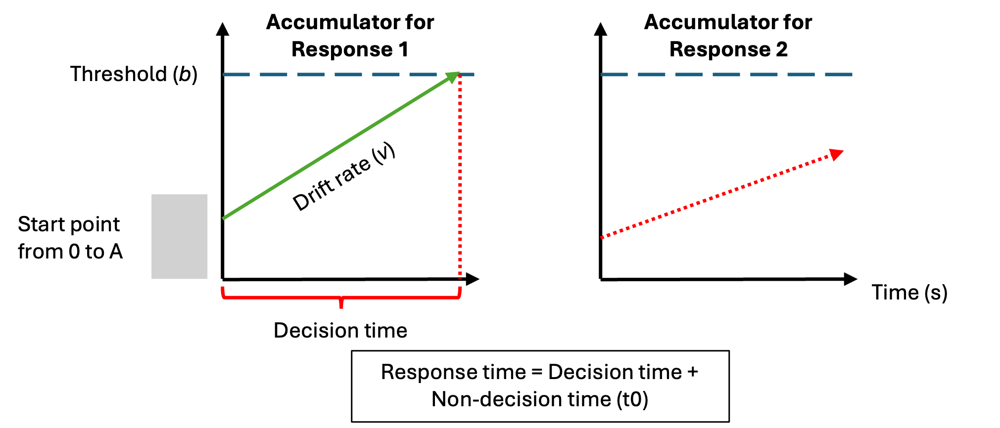
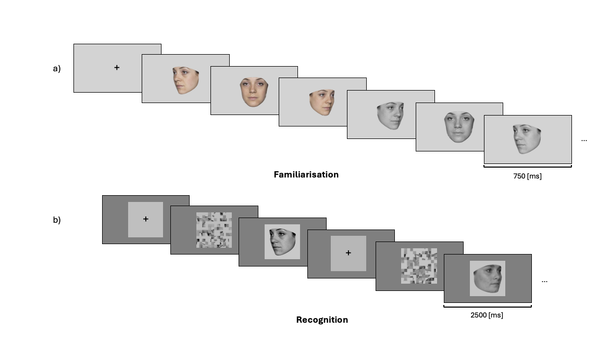

```{r}
#| label: setup
#| include: false

pkgs <- c(
  "tidyverse",
  "tinytable",
  "RColorBrewer",
  "patchwork",
  "paletteer",
  "here",
  "EMC2",
  "tidybayes",
  "tinytable",
  "osfr",
  "svglite",
  "gt",
  "brms",
  "corrplot",
  "ggdist",
  "parallel",
  "future",
  "ggplot2",
  "ggh4x",
  "gridExtra",
  "ggpubr",
  "modelr",
  "cmdstanr",
  "standist"
)
vapply(
  pkgs,
  library,
  logical(1),
  character.only = TRUE,
  logical.return = TRUE
)

knitr::opts_chunk$set(echo = FALSE)

## Manuscript-wide plot theme ##
# One theme for every figure. Figures are drawn at the width of the text
# block (fig.width = 6.5 in the YAML header), so base_size = 10 renders as
# true 10 pt text on the page.
theme_manuscript <- function(base_size = 10) {
  theme_classic(base_size = base_size) +
    theme(
      axis.title = element_text(face = "bold"),
      axis.text = element_text(colour = "black"),
      strip.background = element_blank(),
      strip.text = element_text(face = "bold", size = rel(1)),
      strip.placement = "outside",
      legend.position = "bottom",
      legend.title = element_text(face = "bold"),
      plot.title = element_text(face = "bold", size = rel(1)),
      plot.margin = margin(5, 10, 5, 5)
    )
}
theme_set(theme_manuscript())

# Text annotations inside plots (r values etc.), ~9 pt
annot_size <- 3

## Manuscript-wide table style ##
tt_manuscript <- function(df, notes = NULL) {
  tt(df, notes = notes) |>
    style_tt(i = 0, bold = TRUE, fontsize = 0.8) |>
    style_tt(i = seq_len(nrow(df)), fontsize = 0.7)
}

## plot settings ##
## Plot colors
safe_pal <- paletteer_d("rcartocolor::Safe", 4)
dark_pal <- paletteer_d("RColorBrewer::Dark2", 2)

myColors_3 <- c(
  "novel" = safe_pal[1],
  "learned" = safe_pal[2]
)
myColors_4 <- c(
  "Novel" = safe_pal[1],
  "Learned" = safe_pal[2]
)

#Accuracy colors
myColors_acc <- c(
  "true" = dark_pal[1],
  "false" = dark_pal[2]
)
myColors_acc_2 <- c(
  "TRUE" = dark_pal[1],
  "FALSE" = dark_pal[2]
)
# Subsets for single-experiment plots if still needed
myColors_1 <- myColors_3[c("novel", "learned")]


## Set the amount of dodge in figures
pd <- position_dodge(0.7)
pd2 <- position_dodge(1)
```



# Introduction

Over the last two decades, pupillometry has become an increasingly popular tool for accessing cognitive processing non-invasively and with high temporal resolution. Pupil size has been linked to a range of cognitive processes, including attention [@Binda2014; @Naber2013; @WangMunoz2015], emotional arousal [@Bradley2008], decision-making [@Murphy2014; @Urai2017], and recognition memory [@GoldingerPapesh2012; @Otero2011]. In recognition memory specifically, a well-documented pattern is the "pupil old/new effect": a greater pupil dilation for the correct recognition of "old" items than for the correct rejection of "new" items, taken to reflect an association between pupil dynamics and memory strength [@Otero2011; @Vo2008; see @Lapteva2024, for a meta-analysis]. In this study, we use a computational modelling approach to investigating the association between face recognition memory and pupil dynamics. Specifically, we link the latent parameters of an evidence-accumulation model to pupil dynamics during a face recognition task.

The pupil old/new effect is a well-documented observation in recognition memory experiments using pupillometry. It refers to a larger pupil dilation for correctly recognised "old" stimuli than for correctly rejected "new" stimuli [@Vo2008; @HeaverHutton2011]. This difference has been proposed to index the strength of the memory trace [@Otero2011], and it is larger when recognition relies on recollection (retrieving specific contextual details of the earlier encounter) rather than familiarity (a sense of having encountered the item before without retrieving such details) [@KafkasMontaldi2015; @TaikhBodner2022]. The effect also extends to false memories. New items wrongly judged "old" elicit larger dilation than correct rejections, though smaller than hits [@Otero2011; @Montefinese2013; @BrocherGraf2016]. This suggests that the participant's subjective judgement of a stimulus as "old" is enough to evoke a stronger pupillary response, regardless of accuracy. Two main explanations have been offered. Early accounts attributed the effect to the greater cognitive effort involved in retrieving an episodic memory [@Vo2008; @GoldingerPapesh2012]. More recent work instead proposes that recognising an item acts as a salient signal that triggers an attentional orienting response. In line with this account, the effect is larger when participants expect a test item to be new but then recognise it as old [@Mill2016].

Pupillometric studies of face recognition remain scarce, but several findings suggest that pupil size is sensitive to face memory. When faces are learned during an experiment, prior exposure modulates pupil responses at test, and these effects appear for both own- and other-race faces [@Goldinger2009; @Wu2012]. Pupil dilation during encoding also predicts later recognition of faces [@CroninLippMarinovic2023]. In eyewitness lineups, participants who correctly identify the culprit show larger pupils for the target than for fillers, sometimes even when they are unsure of their choice, which points to covert recognition [@ElphickPikeHole2020]. Pre-experimentally familiar faces produce a similar pattern: familiar faces reduce the initial constriction and increase dilation relative to unknown faces, most strongly for one's own face [@Schwetlick2025]. This familiarity response survives perceptual suppression that abolishes overt recognition [@MejiaValdesSosaBobes2024] and appears for personally familiar faces presented in rapid serial streams [@Chen2026]. However, not all studies agree. One study found smaller dilations for more familiar faces, but only during an active task, suggesting that task demands shape the direction of the effect [@MatyjekBayerDziobek2021]. 

The pupil old/new effect has typically been examined by sorting pupil responses according to response accuracy (hits, misses, false alarms and correct rejections). This approach overlooks a second, equally informative aspect of performance: response times. Considering accuracy or response times in isolation can lead to misleading conclusions about the underlying cognitive processes [REF Wagnemakers]. Evidence-accumulation models offer a principled solution to this problem [@Ratcliff1978; @BrownHeathcote2008]. They assume that decisions arise from the accumulation of evidence until a response threshold is reached, and they decompose choices and full response time distributions into latent components: the rate of evidence accumulation (drift rate), the amount of evidence required to respond (threshold), response bias, and non-decision time (see @fig-LBA). Linking pupil size to these parameters, rather than to raw accuracy categories, can therefore specify which decision process pupil dilation reflects. Previous work has already related pupil dilation to decision thresholds [@Cavanagh2014], to reduced choice bias in evidence accumulation [@deGee2014, @deGee2017], including in memory-based decisions [@deGee2020], and to urgency signals [@Murphy2016]. However, these associations have not yet been tested in face recognition, a domain in which the effects of familiarity on decision processes have been characterized behaviorally [@fournier2026familiarity], but not yet linked to pupil dynamics.


:::: {.place arguments="bottom, scope: \"parent\", float: true"}
:::{#fig-LBA fig-cap = "Schematic of the linear ballistic accumulator (LBA) model"}
{width="90%"}
:::

*This diagram represents the accumulation process one trial of a perceptual decision task for the linear ballistic accumulator (LBA;* @BrownHeathcote2008*). Participants are required to chose between two options (Response 1 and Response 2). In a LBA model, there is a separated accumulation of evidence (v) for each response option. In this example, the correct response is Response 1. The accumulator on the left is the accumulator for the correct response (Response 1), and the green line in represents the rate at which the evidence accumulates in favor of that response option. The accumulator on the right is the accumulator for the incorrect response (Response 2), and the dash red line represents the rate at which the evidence accumulates in favor of this response option. Once the accumulated evidence crosses the threshold (b) of a response option, the corresponding response is chosen (in this case Response 1).* 
::::

In the present study, therefore, we combined pupillometry with computational modelling to investigate how latent computational processes in face recognition are related to pupil size dynamics. We previously investigated the extent to which drift rate and threshold are associated with pupil size dynamics for old (learned) and new (novel) faces [@fournier2026familiarity]. Using an old/new recognition task in combination with evidence accumulation modelling, we found that novel compared to familiar faces induced a greater accumulation of evidence (drift rate), as well as modest increase in response caution (threshold). Given these past results, the present study had two aims. First, we sought to establish the pupil old/new effect in the context of face recognition memory. Second, we examined how pupil dynamics relate to the latent processes underlying face recognition decisions. Specifically, we asked whether the quality of evidence accumulation (drift rate) and response caution (threshold) estimated form a face recognition task were associated with three pupil metrics: mean pupil size, peak pupil size, and the rate of pupil change.

Based on previous memory recognition studies, we expected to observe a pupil old/new effect for faces. On correct trials, pupil size should be larger for correctly recognized learned faces (hits) than for correctly rejected novel faces (correct rejections). On incorrect trials, we expected this pattern to invert. Because the pupil response tracks the participant's judgement that an item is "old" rather than the item's true status [@KafkasMontaldi2015; @Montefinese2013; @Oliveira2021; @Otero2011], pupil size should be larger for novel faces wrongly judged as learned (false alarms) than for learned faces wrongly judged as novel (misses).  Finally, we expected individuals with larger pupil-size differences between conditions to also show larger differences in drift rate and/or threshold. Drift rate for learned faces should positively correlate with pupil whereas the predictions are less clear for drift rate for novel faces or for threshold.

# Method and Materials

## Pre-registration and open science

We report how we determined our sample size, all data exclusions (if any), all manipulations, and all measures in the study [@simonsConstraintsGeneralityCOG2017].
The research question, hypotheses, experimental design, planned analysis, and exclusion criteria were preregistered (<https://osf.io/yr2z6/overview>).
Raw data, preprocessing code for pupil data as well as the data analysis code are available on Github (link github).

```{r}
#| label: exclusion-all
#| include: false
data <- read_csv(here::here("data/data.csv"))

exclusions <- read_csv(here::here("data/exclusions.csv"))

# ── Extract scalars for inline text ──────────────────────────────────────────
completed <- as.integer(
  exclusions$n_removed[exclusions$stage == "1"] +
    exclusions$n_remain[exclusions$stage == "1"]
)
exclude_missed_trials <- as.integer(exclusions$n_removed[
  exclusions$stage == "1"
])
exclude_rt <- as.integer(exclusions$n_removed[exclusions$stage == "2"])
exclude_acc <- as.integer(exclusions$n_removed[exclusions$stage == "3a"])
exclude_pupil <- 1
final <- as.integer(exclusions$n_remain[exclusions$stage == "3a"]) -
  exclude_pupil
```

```{r}
#| label: demographics-all
#| include: false
demo <- read_csv(here("data/data_demo_WP3.csv"))

# ── Extract scalars for inline text ──────────────────────────────────────────
male <- as.integer(sum(demo$Gender == "M"))
female <- as.integer(sum(demo$Gender == "F"))
mean_age <- as.numeric(round(mean(demo$age), 1))
sd_age <- as.numeric(round(sd(demo$age), 1))
min_age <- as.numeric(min(demo$age))
max_age <- as.numeric(max(demo$age))
```

## Participants

All participants were recruited using either an online recruiting platform (<https://marktplatz.uzhalumni.ch>) or via a mailing list dedicated to students from the Department of Psychology of the University of Zurich.
`r completed` participants completed the experiment. 
Following our preregistered exclusion criterion, `r exclude_missed_trials` participant was excluded because their percentage of missed trials was higher than 40%, `r exclude_acc` was removed because the overall accuracy was lower than 55% and finally `r exclude_pupil` participant was removed because the percentage of trials containing more that 20% of pupil data missing samples during the baseline period or during the stimulus presentation was higher than 40%.
In the end, data from `r final` participants (`r male` men and `r female` women) were retained for the analysis and the LBA modeling.
Ages ranged from `r min_age` to `r max_age` ($M_{age} =$ `r mean_age`, $SD_{age} =$ `r sd_age`) and each participant received 25 CHF for the completion of the study.
This experiment was accepted by the ethics committee of the Federal Institute of technology (ETH) Zurich.

## Material

Stimuli were presented on a 24-inch monitor (1920 × 1200 px, 60 Hz refresh rate, Philips PHL 240P4QPY) at a viewing distance of approximately 65 cm.  Stimulus presentation and response collection were implemented in Psychopy Builder R2024a (version -> check) running on a Linux operating system (Ubuntu 22.04.5 LTS). The code used for the experimental procedure can be found on OSF (link OSF). Pupil data for the left and right eye were recorded using a Tobii Pro Spark (Tobii AB) eye tracking device at a 60 Hz sampling rate and measured in mm. The eye tracking device was placed at the bottom of the desktop computer screen. The head of the participants was fixed using a chin rest, such that the distance between the eyes and the computer screen was the same for all participants.

## Procedure

The experimental procedure is similar to the one used by @fournier2026familiarity. The face recognition task was divided into two parts: a familiarization part and a recognition part (see @fig-proc-exp-pupil). In the familiarization part, participants were instructed to memorize the identity of unknown faces. One familiarization trial consisted of passively viewing 6 face images of the same identity presented one after the other but varying in viewing points (3/4 left view, frontal view and 3/4 right view) and the colorimetry (colorful image, gray scale image). Each image was presented for 0.75 second and participants underwent 30 familiarization trials. The faces presented during the familiarization part were considered the “Learned faces” within-subject condition.

In the recognition part, participants completed three blocks of 60 recognition trials, each block being separated from another by a short break. Half of the trials were “Learned” identities and the other half were “Novel”, previously unseen, identities. Each recognition trial was divided into three parts: a fixation cross, a scrambled image of a face and the gray scale image of the same face. During the fixation cross presentation, participants were told to look at the fixation cross in the middle of the screen. They were also instructed to blink during that time if they needed to and to avoid blinking after the fixation cross disappeared. During the scramble image presentation, participant were told to fixate the scramble image, and not to do anything else. Finally, during the face image presentation, participants were asked to choose if they had previously seen this person in the familiarization part or not. If they did, they should press the “q” key and if they did not, the “p” key. One important note is that participants never saw two pictures of the same learned identity in the same block and never the same picture (3/4 left view, frontal view and 3/4 right view) of a learned identity during the entire recognition part. Furthermore, each novel identity picture was only presented once during the recognition part. Response time [s] and accuracy were collected after each recognition trial. A response time limit of 2500 ms has been set for each recognition trial. If participants did not press a key before the response time limit, the trial was discarded from further analysis and not replaced. The experiment took place in a dim light testing room. We measured the illuminance from the chin rest pointing towards the lamps in the ceiling of the resting room (illuminance = 29.5 lux).

:::: {.place arguments="bottom, scope: \"parent\", float: true"}
:::{#fig-proc-exp-pupil fig-cap = "Experimental procedure of the face recognition task"}

:::
*The experimental procedure was divided into two parts: a familiarization part and a recognition part. a) In the familiarization part, participants were asked to memorize the face identity of 30 identities. For each identity, participants looked at 6 pictures depicting the same identity with different face orientation (3/4 left view, frontal view and 3/4 right view) and different colorimetry (color and gray scale images) in the order presented here: 3/4 left view, frontal view and 3/4 right view in color, followed by 3/4 right view, frontal view and 3/4 left view in gray scale. b) In each trial of the recognition part, participants had to decided if they recognize the face shown on the screen from the familiarization part. If they did, they had to press the "q" key and if the did not, the "p" key. They completed three blocks of 60 trials (half of them were from the familiarization part, half were novel faces). For the recognition part, only gray scale images of faces were used (for both learned faces and novel faces).* 
::::

## Stimuli

The face images consisted of images selected from two different data sets: the Face Research Lab London Set ( <https://doi.org/10.6084/m9.figshare.5047666.v5>) and the Color FERET Database (<https://www.nist.gov/itl/products-and-services/color-feret-database>). From each selected identity, three face pictures at different viewpoints (3/4 left view, frontal view, ¾ right view) were cropped following the outline of the face and grey scaled. To ensure that the stimuli used are reproducible, we used the webmorphR R Package [@webmorph] to crop the face images. The code used to crop the images can be found on OSF (link OSF). The pictures obtained at this stage in the image processing pipeline were used in the familiarization part of the experimental task. 

Since pupil size is highly sensitive to brightness and contrast changes between stimuli, we equated the average pixel values (as a measure of brightness) and the standard deviation of pixel values in order to match brightness and contrast (mean brightness = 30.33, mean contrast= 41.42; @MathotVilotijevic2022). These images were then placed on a darker grey background covering the entire desktop screen.
For the scrambled image described above, we used a custom Matlab code to scramble all the greyscale image of each face images. To ensure that there were no difference in brightness and contrast between the scrambled image and the face image, the same face image was used in each trial: first, the scrambled version of the image followed by the non-scrambled version of the image. The code used to scramble the face images can be found in OSF (link OSF).

To assess if there was important variation in the difference between the luminous flux coming from the stimuli and the illuminance of the room, we averaged the luminous flux from all the images which were matched in brightness and contrast. The average luminous flux coming from our stimuli was 29.01 cd/m2 (SD = 1.19 cd/m2), a reasonably similar value to the 29.5 lux obtained from the illuminance measurement [@MathotVilotijevic2022]. 

## Pupil preprocessing and pupil metrics

Pupil data was only collected during the recognition part of the experiment. Each participant underwent a 5-point calibration phase during the break in between the familiarization and the recognition part. Samples identified as blinks were set to NA. The blink window was extended by 75 ms on each side of the sample to remove partial blinks artifacts (i.e. lid drooping and reopening) that surrounds the “true” blink. Pupil samples that deviated more than 8 median absolute deviations from the median are set to NA. This preprocessing stage was run twice in sequence, where the second pass caught artefacts that were masked by larger ones in the first pass. Regarding NA samples, each trial was then evaluated separately for the baseline and the stimulus windows. A trial was discarded if more that 20% of the samples were NA in the baseline period (set to 200ms before the target onset) or in the stimulus period (from target onset to target offset; @MathotVilotijevic2022). The pupil data were then upsampled to a uniform time grid at 1000Hz sampling rate to ensure equally-spaces samples before interpolation and smoothing. Remaining NA samples were linearly interpolated. Finally, a zero-phase 4th-order Butterworth low-pass filter with a 6 Hz cutoff was applied to remove higher frequencies while keeping slower pupil responses. After interpolation, the pupil data were downsampled to 50 Hz to reduce the risk of autocorrelation in time-series analyses [@VanRij2019].

Pupil data was baseline corrected using a subtractive correction [@MathotVilotijevic2022], meaning that we subtracted the mean pupil size of the 200ms period before the stimulus onset from every pupil size sample during the stimulus presentation, for both left and right pupil size. The left and right eye signals were then averaged sample-by-sample into a single mean pupil trace. We discarded the pupil data from the last 100ms of the stimulus presentation (from 2400 to 2500ms) to ensure data quality.

From the pupil traces, three different pupil metrics were extracted: the mean pupil size, the peak pupil size and the rate of pupil change. 

*Mean pupil size*: The mean pupil size reflected the average of the pupil size across the entire face presentation (from 0 to 2400ms) for each trial and each participant. 

*Peak pupil size*: We calculated the maximum pupil size deviation from baseline after stimulus onset. We isolated the minimum sample value in the baseline (200ms before stimulus onset) and the maximum sample value in the stimulus presentation (2400ms after stimulus onset) in each trial for each participant. Following previous studies [@BrocherGraf2016; @KafkasMontaldi2015], we then average the value of the 3 preceding and 3 following samples from the two isolated sample values. For statistical analyses, we used the difference between the maximal pupil size during stimulus presentation and the minimal value during baseline, referred to as "peak pupil size" in the rest of the manuscript. 

*Rate of pupil change*: For each trial and participant, we calculated the first derivative of all the sample values from the stimulus onset or the stimulus offset (0-2400ms) in order to obtain the rate of pupil change. From this new time-series, we extracted the values of the samples 200ms before the behavioral response (response locked) and averaged them for each trial [@deGee2020].

## Evidence accumulation modeling

Model and prior specifications, as well as the model estimation procedures, are identical to the ones described in @fournier2026familiarity. Specifications of the priors are described in Supplementary Materials.

### Model specifications

A hierarchical LBA models was fit to the accuracy and response times of the face recognition task.
The model specifications are outlined in our preregistration (@tbl-model-formula).
The LBA framework assumes a separate evidence accumulator for each response alternative, with potentially different parameter values.
Accordingly, one accumulator corresponded to the "Learned" response and the other to the "Novel" response.
Threshold was allowed to vary by participants' response (Learned/Novel) and mean drift rate varied as a function of both stimulus type (Learned/Novel) and weather the accumulator corresponded to the correct response for that stimulus (TRUE vs. FALSE).
For example, when a Learned stimulus was presented, the Learned accumulator was designed as TRUE, whereas the Novel accumulator was designed as FALSE.
The difference in drift rate between the TRUE and FALSE accumulators reflects the quality of information supporting a decision, with larger differences indicating stronger and more discriminative evidence accumulation [@lewandowskyComputationalModelingCognition2018].
The standard deviation of the TRUE accumulator was allowed to vary according to accumulator match status, whereas the standard deviation of the FALSE accumulator was constrained to be constant to ensure model identifiability [@donkinGettingMoreAccuracy2009].
In the preregistered model, a single start-point parameter (A), and single non-decision time parameter (t0) were estimated.
Alternative model specifications that permitted variation in these parameters are reported in the Supplementary Materials.

```{r}
#| label: data-model-formula
#| include: false
# create a table
lba_formula <- tribble(
  ~Parameter            , ~Label       , ~Condition , ~Response , ~Accuracy , ~Fixed ,
  "Start point"         , "A"          , "no"       , "no"      , "no"      , "-"    ,
  "Mean drift rate"     , "v"          , "yes"      , "no"      , "yes"     , "-"    ,
  "SD drift rate"       , "sd_v"       , "no"       , "no"      , "yes"     , "-"    ,
  "SD false drift rate" , "false.sd_v" , "-"        , "-"       , "-"       , "1"    ,
  "Threshold"           , "b"          , "no"       , "yes"     , "no"      , "-"    ,
  "Non-decision time"   , "t0"         , "no"       , "no"      , "no"      , "-"
)
```

```{r}
#| label: tbl-model-formula
#| tbl-cap: "Formula specification for the pre-registered linear ballistic accumulator model."
#| include: true
tt_manuscript(
  lba_formula,
  notes = "Condition = training condition (Learned vs. Novel); Response = key-press response (Learned vs. Novel); Accuracy = accumulator match (TRUE/correct vs. FALSE/incorrect); SD = standard deviation."
)
```

### Model estimation 

Bayesian model estimated was carried using the EMC2 R package [@EMC2].
Priors were chosen to be weakly-informative, meaning that they have little influence on the estimation (for more details regarding the priors of each model, see Supplementary Materials).
Two sampling steps were used to estimate the parameters.
First, a separate estimation of the fixed effects for each participant was conducted.
Parameter estimations were then used as the starting point for the full hierarchical parameter estimation.

### Model fit 

To ensure that the fit of our model can capture most of the main trends in the data, graphical summaries of the posterior predictions were examined.
Convergence plots and posterior predictive checks can be found in Supplementary Materials.

## Data analysis

### Overview of the general analytical strategy

First, the posterior distributions of LBA parameters were estimated and contrasts between conditions of interest were computed to ensure that we replicated the results found in @fournier2026familiarity. Second, a hierarchical generalized additive mixed model (HGAMM; @VanRij2019; @Pederson2019) was fitted to the pupil data in order to investigate the pupil old/new effect. We also used a Bayesian multilevel mixed model to compare pupil metrics (mean pupil size, maximum pupil size and rate of pupil change) between stimulus conditions (Learned vs Novel) and accuracy conditions (correct trials vs incorrect trials).

Third, regarding the associations between pupil size metrics and LBA parameters, we used correlations and data visualizations to characterize the zero-order relationships between parameters of interest (drift rate and threshold) from the LBA model with pupil size metrics. A "classical" correlation approach to generate point estimates of the correlation value and present those alongside scatter plots, as well as a Bayesian plausible value correlation approach to estimate the uncertainty in the estimated correlation values.
Finally, in an exploratory analysis, we fitted a hierarchical Bayesian joint-model combining a Linear Ballistic Accumulator (LBA) model of response times and accuracy with mean pupil size. 
The details of the analysis plan were preregistered (<https://osf.io/abpdy/overview>) and more specific details are presented below.

### LBA parameters

In order to make inferences about the potential associations between LBA parameters and pupil size metrics, subject specific estimates and group estimates posterior distributions were computed.
Group estimates were contrasted between conditions (Learned vs Novel) to establish that the basic experimental effect found in @fournier2026familiarity could be replicated at the group level.
To summarize the distribution of parameters of interest, we report the median of the posterior distribution together with 95% quantile interval of the posterior distribution.
Assessment of the associations between parameter estimates and pupil size metrics was pursued using subject specific estimates.

### Hierarchical generalized additive mixed model (HGAMM)

To test whether the time course of pupil dilation differed between conditions, we analysed the pupil traces with a hierarchical generalised additive mixed model (HGAMM; @Wood2011; @Wood2017; @Pedersen2019), an approach that has been applied successfully to pupillometric data [@VanRij2019]. GAMMs are well-suited to pupil data for four reasons. First, the pupil response follows a nonlinear time course whose shape is not exactly known in advance. GAMMs estimate the shape of the curve directly from the data using smooth functions (splines), and a penalty on the wiggliness of each smooth guards against overfitting. Second, the whole time course can be modelled at once, so the analysis does not depend on averaging the signal within arbitrarily chosen time windows. Differences between conditions can likewise be estimated as smooth functions of time, which shows when they emerge and how they evolve. Third, pupil time series are strongly autocorrelated, and GAMMs can account for this dependency [@VanRij2019]. In our case, we downsampled the pupil signal to 50 Hz to reduce autocorrelation between successive samples, following the recommendations of @VanRij2019. Fourth, a hierarchical extension adds participant-level smooths alongside the condition-level smooths, so that each participant's pupil response can differ in shape as well as in overall level. Through partial pooling, these individual curves are shrunk towards the group-level curve, which gives more stable estimates for participants with noisier data while still capturing individual variability [@Pedersen2019].
The model specifications can be seen in @tbl-pupil-metrics-GAMM-formula. From the model predictions, the expected median pupil dilation signal was compared between conditions of interest: for Correct trials (Learned vs.Novel) to visualize the potential pupil "old/new" effect and separately for incorrect trials (Learned vs. Novel). The R package brms [@brms] was used to fit the GAMM model. 

```{r}
#| label: pupil-metrics-GAMM-formula
#| include: false
# create a df
regression_formula_gamm <- tribble(
  ~`GAMM formula`                                                                                                           ,
  "Pupil diameter (mm): 1 + int_cond + s(time, by = int_cond, bs = bs, k = 10) + s(time, pid, bs = fs, xt = list(bs = bs))"
)
```

```{r}
#| label: tbl-pupil-metrics-GAMM-formula
#| tbl-cap: "Formula specification for the hierarchical generalized additive mixed model (HGAMM) of the pupil time series."
#| include: true
tt_manuscript(
  regression_formula_gamm,
  notes = "Pupil diameter (mm) = baseline-corrected pupil size (mm); int_cond = cells of the 2 × 2 design (Learned_correct, Learned_incorrect, Novel_correct, Novel_incorrect); time = time bins of 20 ms; pid = participant."
)
```


### Pupil metrics

Pupil metrics (mean pupil size, peak pupil size and rate of pupil change) were compared between response accuracy (Correct vs. Incorrect trials) and stimulus conditions (Learned vs. Novel). For each pupil metrics, a multilevel Bayesian model was fitted and the specifications of each model can be seen in @tbl-pupil-metrics-model-formula. The R package brms [@brms] was used to fit the three Bayesian multilevel models. 

```{r}
#| label: pupil-metrics-model-formula
#| include: false
# create a df
regression_formula_metrics <- tribble(
  ~`Pupil metrics`       , ~Condition             , ~Formula                                                           ,
  "Mean pupil size"      , "familiarity:accuracy" , "Mean pupil size:  0 + familiarity:accuracy + (1|participant)"     ,
  "Peak pupil size"      , "familiarity:accuracy" , "Peak pupil size: 0 + familiarity:accuracy + (1|participant)"      ,
  "Rate of pupil change" , "familiarity:accuracy" , "Rate of pupil change: 0 + familiarity:accuracy + (1|participant)"
)
```

```{r}
#| label: tbl-pupil-metrics-model-formula
#| tbl-cap: "Formula specification for the multilevel Bayesian models of the pupil metrics."
#| include: true
tt_manuscript(
  regression_formula_metrics,
  notes = "familiarity = face familiarity (Learned vs. Novel); accuracy = response accuracy (Correct vs. Incorrect)."
)
```

### Point estimates correlations

To evaluate the associations between pupil size and LBA parameters, we calculated the median value of the subject-level posterior distribution of each of our parameter of interest and correlated this value with the three pupil metrics extracted from the pupil data time-series (mean pupil size, maximum pupil size and rate of pupil change) at the subject level.
For the threshold parameter, we computed the median of the two threshold parameters (threshold for learned and novel responses).
For the drift rate parameter, we computed the median of two drift rate parameters.
Drift rate (TRUE-FALSE) is the subtraction drift rate (TRUE) - drift rate (FALSE) and represent the signal to noise ratio provided by the stimulus.
For each stimulus condition (Learned and Novel), the median drift rate (TRUE-FALSE) was computed.

All median values of these parameters posterior distribution were then correlated with the average of the pupil metrics for each corresponding conditions, for each subject. More specifically, Drift rate (TRUE-FALSE) was correlated with the difference in pupil metrics between correct and incorrect trials for each condition (ex: Drift rate (TRUE-FALSE) x (Mean pupil size (Correct) - Mean pupil size (Incorrect)). 
Regarding threshold we correlated pupil metrics in function of the response of the participant. The threshold learned parameter was correlates with pupil metrics when the response of the participant was "Learned", and threshold novel parameter was correlates with pupil metrics when the response of the participant was "Novel", independently of the accuracy of the response. 

### Bayesian plausible value correlational analysis

In addition to the classical correlational analysis described above, we conducted a Bayesian plausible value correlation approach [@lyFlexibleEfficientHierarchical2017; @matzkeBayesianInferenceCorrelations2017].
Instead of using point estimates (median value of each parameter's posterior distribution), this approach allows the estimation of uncertainty in likely correlational values by correlating the parameter estimation from each sample (or “draw”) from the posterior distribution with the pupil metrics.
A distribution of the plausible correlations between each parameter and the pupil metrics can then be obtained.
These distributions can then be compared between stimuli conditions (Learned vs Novel).
By summarising the posterior distribution of these correlation values, this approach naturally lends itself to estimates of the uncertainty of the estimated correlation values.

### Joint modelling

Beyond estimating post hoc associations between our parameters of interest and pupil metrics, we also fit a joint model linking the behavioral and pupil data directly. Joint modelling offers a way to combine multiple data streams, such as choice/RT data and physiological measures, within a single estimation framework, rather than analyzing each in isolation and relating them afterwards [@Turner2013; @Turner2017; @Turner2019]. Unlike post hoc correlations, which treat each parameter's point estimate as fixed and known, joint models estimate the relationship between data sources as part of the same generative process, so that measurement uncertainty in each parameter is propagated into the estimated association rather than discarded [@Turner2015; @Nunez2024]. By jointly modelling behavioral (response time and accuracy) and pupil data within a single hierarchical framework, we sought to characterize the magnitude of pupil–behavior relationships in a way that accounts for this shared uncertainty. It is important to stress that this analysis remains exploratory: our aim was to evaluate the feasibility of jointly modelling LBA and pupillometric data, and no substantive inferences are drawn from its results.

To fit a joint model, we used the EMC2 R package [@EMC2] to fit a hierarchical Bayesian model combining a Linear Ballistic Accumulator (LBA) model of response times and accuracy with a pupil component. In the LBA, drift rates varied by stimulus type (learned/novel) and accumulator match (match/mismatch), thresholds by response option, and start-point variability and non-decision time were estimated as single parameters, with the drift-rate variability of the mismatching accumulator fixed for identifiability. Mean baseline-corrected pupil size per trial was modeled with a Gaussian regression (via EMC2's design_fmri function, used here as a generic GLM engine, without convolution) with one regressor per trial type (Learned_Correct, Learned_Incorrect, Novel_Correct, Novel_Incorrect). Behavioral and pupil parameters were estimated together, so that individual differences in both were drawn from a shared multivariate distribution. From the resulting subject-level posterior draws, we computed correlations between conditions of interest. In our case, we extracted the mean posterior draws for Drift rate Learned (TRUE-FALSE) and Novel (TRUE-FALSE) and correlated them with the posterior draws of the mean pupil size for the learned condition (Correct-Incorrect) and for the novel condition (Correct-Incorrect). The objective was to estimate if we could retrieve the correlations obtained in the point estimates correlations section as well as the ones obtained in the plausible values section. As mentioned, this analysis is exploratory and was intended as a proof of concept for a joint modelling pipeline of pupil and behavioral data.


### Inferential criteria

To evaluate the different posterior distributions estimated from the data analysis, we used three complementary criteria: sign, size and precision [@cummingNewStatisticsWhy2014; @kruschkeBayesianDataAnalysis2018; @mcelreath2018statistical].
First, to address the sign (or direction) of the effect, we reported if the median value is positive or negative.
Second, we evaluated the size or magnitude of the posterior distribution by considering the size of the median value.
Third, we evaluated precision via the quantile interval estimates.
For example, if the 95% quantile interval excluded zero, we would have been reasonably confident in our inference of a non-zero effect.
More generally, narrow estimates indicate precise estimates, wider intervals indicate substantial uncertainty about the estimated parameter value, which may warrant a more cautious interpretation.

# Results

## LBA parameters

In this section, we describe the posterior distributions of the drift rate and threshold parameters for both Learned and Novel faces estimated from the distribution of response times and accuracy collected in the face recognition task.
These distributions reflect the group-level effects of the two stimulus condition on drift rate (learned vs novel) and response conditions on threshold (learned vs novel).
Contrasts between conditions were plotted to assess the difference between them. Posterior distributions for threshold and drift rate parameters are visualized in @fig-param and the medians and 95% quantile intervals are summarized in @tbl-lba-params.

```{r}
#| label: load-lba-data
#| include: false
theta_group <- read_csv(here("data/theta_group.csv"))
theta_group_q <- read_csv(here("data/theta_group_q.csv"))
theta_pid <- read_csv(here("data/theta_pid.csv"))
theta_pid_q <- read_csv(here("data/theta_pid_q.csv"))
```

```{r}
#| label: wrangle-threshold
#| include: false
thresh_group <- theta_group |>
  filter(str_detect(param, "B_")) |>
  mutate(
    response = if_else(str_detect(param, "lRLearned"), "Learned", "Novel"),
    response = factor(response, levels = c("Learned", "Novel"))
  ) |>
  rename(.draw = "datapoint")

thresh_pid <- theta_pid |>
  filter(str_detect(param, "B_")) |>
  mutate(
    response = if_else(str_detect(param, "lRLearned"), "Learned", "Novel"),
    response = factor(response, levels = c("Learned", "Novel"))
  ) |>
  rename(.draw = "datapoint")

thresh_diff_group <- thresh_group |>
  pivot_wider(id_cols = c(.draw), names_from = response, values_from = value) |>
  mutate(diff = Novel - Learned)

thresh_diff_pid <- thresh_pid |>
  pivot_wider(
    id_cols = c(pid, .draw),
    names_from = response,
    values_from = value
  ) |>
  mutate(diff = Novel - Learned)

# quantiles
thresh_diff_group_q <- thresh_diff_group |> median_qi(diff)
thresh_diff_pid_q <- thresh_diff_pid |> group_by(pid) |> median_qi(diff)
```

```{r}
#| label: wrangle-drift
#| include: false
drift_group <- theta_group |>
  filter(str_detect(param, "v_S")) |>
  mutate(
    condition = if_else(str_detect(param, "Novel"), "Novel", "Learned"),
    accuracy = if_else(str_detect(param, "TRUE"), "True", "False"),
    condition = factor(condition, levels = c("Learned", "Novel")),
    accuracy = factor(accuracy, levels = c("False", "True"))
  ) |>
  rename(.draw = "datapoint")

drift_pid <- theta_pid |>
  filter(str_detect(param, "v_S")) |>
  mutate(
    condition = if_else(str_detect(param, "Novel"), "Novel", "Learned"),
    accuracy = if_else(str_detect(param, "TRUE"), "True", "False"),
    condition = factor(condition, levels = c("Learned", "Novel")),
    accuracy = factor(accuracy, levels = c("False", "True"))
  ) |>
  rename(.draw = "datapoint")

# true - false per condition
drift_acc_diff_group <- drift_group |>
  pivot_wider(
    id_cols = c(.draw, condition),
    names_from = accuracy,
    values_from = value
  ) |>
  mutate(diff = True - False)

drift_acc_diff_pid <- drift_pid |>
  pivot_wider(
    id_cols = c(pid, .draw, condition),
    names_from = accuracy,
    values_from = value
  ) |>
  mutate(diff = True - False)

# novel - learned contrast
drift_cond_diff_group <- drift_acc_diff_group |>
  pivot_wider(id_cols = .draw, names_from = condition, values_from = diff) |>
  mutate(diff = Novel - Learned)

drift_cond_diff_pid <- drift_acc_diff_pid |>
  pivot_wider(
    id_cols = c(pid, .draw),
    names_from = condition,
    values_from = diff
  ) |>
  mutate(diff = Novel - Learned)

# quantiles
drift_acc_diff_group_q <- drift_acc_diff_group |>
  group_by(condition) |>
  median_qi(diff)
drift_cond_diff_group_q <- drift_cond_diff_group |> median_qi(diff)
drift_cond_diff_pid_q <- drift_cond_diff_pid |> group_by(pid) |> median_qi(diff)
```

*Threshold*: Inspection of the posterior distributions shows that there is an effect of familiarity on the threshold parameter.
The threshold parameter is higher for the Novel response compared to the Learned response.

```{r}
#| label: fig-param
#| fig-cap: " Threshold and drift rate estimates.Points denote the median of the distribution and error bars the 66% and 95% QI intervals."
#| fig-subcap:
#|   - "Left panel: Threshold by response / Right panel: Threshold (novel - learned) contrast"
#|   - "Left panel: Drift rate (TRUE - FALSE) by stimulus / Right panel: Drift rate (novel - learned) contrast"
#| layout-nrow: 2
#| fig-height: 2.6
# Threshold plots
# Left panel: condition distributions
p_thresh_group_cond <- ggplot(
  thresh_group,
  aes(x = value, y = fct_rev(response), fill = response)
) +
  stat_halfeye(alpha = 0.7) +
  geom_vline(xintercept = 0, colour = "darkgrey") +
  scale_fill_manual(values = myColors_4) +
  scale_y_discrete(drop = TRUE) +
  labs(x = "Threshold", y = "Response") +
  theme(legend.position = "none")

# Right panel: contrast
p_thresh_group_diff <- ggplot(thresh_diff_group, aes(x = diff, y = "")) +
  stat_halfeye(alpha = 0.7, fill = "#1A7A7A") +
  geom_vline(xintercept = 0, colour = "darkgrey") +
  labs(x = "Threshold (Novel - Learned)", y = "")

# Drift rate plots
# Left panel: condition distributions
p_drift_group_cond <- ggplot(
  drift_acc_diff_group,
  aes(x = diff, y = fct_rev(condition), fill = condition)
) +
  stat_halfeye(alpha = 0.7) +
  geom_vline(xintercept = 0, colour = "darkgrey") +
  scale_fill_manual(values = myColors_4) +
  scale_y_discrete(drop = TRUE) +
  labs(x = "Drift rate (TRUE - FALSE)", y = "Condition") +
  theme(legend.position = "none")

# Right panel: contrast
p_drift_group_diff <- ggplot(drift_cond_diff_group, aes(x = diff, y = "")) +
  stat_halfeye(alpha = 0.7, fill = "#1A7A7A") +
  geom_vline(xintercept = 0, colour = "darkgrey") +
  labs(x = "Drift rate (Novel - Learned)", y = "")


p_thresh_group_cond | p_thresh_group_diff
p_drift_group_cond | p_drift_group_diff
```

*Drift rate*: Inspection of the posterior distributions shows that there is a familiarity effect in drift rate difference.
The quality of the evidence accumulation was greater for Novel faces compared to Learned faces.


```{r}
#| label: tbl-lba-params
#| tbl-cap: "Posterior median and 95% quantile intervals for threshold and drift rate parameters."
#| include: true
#Build table
thresh_cond_table <- theta_group_q |>
  filter(str_detect(param, "B_")) |>
  mutate(
    parameter = "Threshold",
    condition = case_when(
      str_detect(param, "lRNovel") ~ "Novel",
      str_detect(param, "lRLearned") ~ "Learned",
    )
  ) |>
  select(parameter, condition, median = value, lower = .lower, upper = .upper)

thresh_table <- thresh_diff_group |>
  median_qi(diff) |>
  mutate(
    parameter = "Threshold contrast",
    condition = "Novel - Learned",
  ) |>
  select(parameter, condition, median = diff, lower = .lower, upper = .upper)

drift_table <- drift_acc_diff_group |>
  group_by(condition) |>
  median_qi(diff) |>
  mutate(parameter = "Drift rate") |>
  select(parameter, condition, median = diff, lower = .lower, upper = .upper)

drift_diff_table <- drift_cond_diff_group |>
  median_qi(diff) |>
  mutate(
    parameter = "Drift rate contrast",
    condition = "Novel - Learned"
  ) |>
  select(parameter, condition, median = diff, lower = .lower, upper = .upper)

## Combine
lba_table <- bind_rows(
  thresh_cond_table,
  thresh_table,
  drift_table,
  drift_diff_table
) |>
  mutate(
    qi = paste0("[", round(lower, 3), ", ", round(upper, 3), "]"),
    median = round(median, 3),
    Parameter = factor(
      parameter,
      levels = c(
        "Threshold",
        "Threshold contrast",
        "Drift rate",
        "Drift rate contrast"
      )
    ),
    Condition = factor(
      condition,
      levels = c(
        "Novel",
        "Learned",
        "Novel - Learned"
      )
    )
  ) |>
  arrange(Parameter, Condition) |>
  select(
    Parameter,
    Condition,
    Median = median,
    `95% QI` = qi
  )
tt_manuscript(
  lba_table,
  notes = "QI = quantile interval."
) |>
  format_tt(j = "Median", digits = 2, num_fmt = "decimal")
```

Together these findings report the same pattern of results for both parameters observed in @fournier2026familiarity and in [IIDpaper].

## Hierarchical generalized additive mixed model (HGAMM)
```{r}
#| label: load-GAMM
#| include: false

bp1 <- read_rds(here("models/model_interaction.rds"))
datam <- read_csv(here("data/datam_processed.csv"))

index_data <- datam %>%
  select(pid, trial, time, `Pupil_Diameter_bc.mm`, int_cond)
```

```{r}
#| label: create-contrasts-plots
#| include: false
grid <- expand_grid(
  time = seq(0, 2.5, length.out = 200),
  condition = c("Learned.true", "Learned.false", "Novel.true", "Novel.false")
)

epred_pid <- index_data %>%
  data_grid(pid, int_cond, time = seq_range(time, n = 200)) %>%
  add_epred_draws(bp1, ndraws = 500)

epred_group <- epred_pid %>%
  group_by(int_cond, time, .draw) %>%
  summarise(
    .epred_group = mean(.epred, na.rm = TRUE),
    sd_group = sd(.epred, na.rm = TRUE)
  )

epred_group_2 <- epred_group |>
  separate(
    int_cond,
    into = c("Condition", "Accuracy"),
    sep = "\\.",
    remove = FALSE
  ) |>
  mutate(
    Condition = factor(Condition, levels = c("Learned", "Novel")),
    Accuracy = factor(Accuracy, levels = c("false", "true"))
  )

summ_traces <- epred_group_2 %>%
  group_by(Accuracy, Condition, time) %>%
  summarise(
    est = median(.epred_group),
    lower = quantile(.epred_group, .025),
    upper = quantile(.epred_group, .975),
    .groups = "drop"
  )

# 2. Difference Learned - Novel, computed WITHIN each draw, then summarised ---
summ_diff <- epred_group_2 %>%
  ungroup() |>
  select(Accuracy, Condition, time, .draw, .epred_group) %>%
  pivot_wider(names_from = Condition, values_from = .epred_group) %>%
  mutate(diff = Learned - Novel) %>%
  group_by(Accuracy, time) %>%
  summarise(
    est = median(diff),
    lower = quantile(diff, .025),
    upper = quantile(diff, .975),
    .groups = "drop"
  )

# Shared y-limits so correct and incorrect rows are directly comparable
trace_lims <- range(c(summ_traces$lower, summ_traces$upper))
diff_lims <- range(c(summ_diff$lower, summ_diff$upper, 0))

diff_draws <- epred_group_2 |>
  ungroup() |>
  select(Accuracy, Condition, time, .draw, .epred_group) |>
  pivot_wider(names_from = Condition, values_from = .epred_group) |>
  mutate(diff = Learned - Novel)

diff_time <- diff_draws |>
  group_by(Accuracy, time) |>
  summarise(
    est = median(diff),
    lower = quantile(diff, .025),
    upper = quantile(diff, .975),
    .groups = "drop"
  ) |>
  mutate(credible = lower > 0 | upper < 0)

# Continuous stretches where the 95% CrI excludes zero
credible_windows <- summ_diff |>
  arrange(Accuracy, time) |>
  mutate(credible = lower > 0 | upper < 0) |>
  group_by(Accuracy) |>
  mutate(run = consecutive_id(credible)) |>
  filter(credible) |>
  group_by(Accuracy, run) |>
  summarise(start = min(time), end = max(time), .groups = "drop")

window_effect <- diff_draws |>
  filter(time >= 1000, time <= 2400) |>
  group_by(Accuracy, .draw) |>
  summarise(diff = mean(diff), .groups = "drop") |>
  group_by(Accuracy) |>
  median_qi(diff)
```


```{r}
#| label: gamm-inline-values
#| include: false

# Averaging window for the effect size (choose a priori, not from the plot)
win_lo <- 0
win_hi <- 2400
win_txt <- paste0(win_lo, "–", win_hi, " ms")

# Longest credible stretch per accuracy level
main_window <- credible_windows |>
  mutate(length = end - start) |>
  group_by(Accuracy) |>
  slice_max(length, n = 1, with_ties = FALSE) |>
  ungroup()

# Learned - Novel averaged over the window, per draw, then summarised
window_effect <- epred_group_2 |>
  ungroup() |>
  filter(time >= win_lo, time <= win_hi) |>
  select(Accuracy, Condition, time, .draw, .epred_group) |>
  pivot_wider(names_from = Condition, values_from = .epred_group) |>
  mutate(diff = Learned - Novel) |>
  group_by(Accuracy, .draw) |>
  summarise(diff = mean(diff), .groups = "drop") |>
  group_by(Accuracy) |>
  median_qi(diff)

# Helpers
cw <- function(acc, what) main_window[[what]][main_window$Accuracy == acc]
we <- function(acc, what) window_effect[[what]][window_effect$Accuracy == acc]
fmt_ms <- function(x) round(x, -1) # nearest 10 ms
fmt_mm <- function(x) sprintf("%.3f", x)

# Correct trials (Learned - Novel)
cor_start <- fmt_ms(cw("true", "start"))
cor_end <- fmt_ms(cw("true", "end"))
cor_est <- fmt_mm(we("true", "diff"))
cor_lower <- fmt_mm(we("true", ".lower"))
cor_upper <- fmt_mm(we("true", ".upper"))

# Incorrect trials, reported as Novel - Learned (false alarms - misses)
inc_start <- fmt_ms(cw("false", "start"))
inc_end <- fmt_ms(cw("false", "end"))
inc_est <- fmt_mm(-we("false", "diff"))
inc_lower <- fmt_mm(-we("false", ".upper"))
inc_upper <- fmt_mm(-we("false", ".lower"))
```

To investigate the pupil old/new effect in our face recognition task, we fitted a GAMM to the baseline-corrected pupil time series. From the posterior distribution of the model, we computed the expected pupil size over time for each cell of the 2 × 2 design, crossing stimulus condition (Learned vs. Novel) with response accuracy (Correct vs. Incorrect), and averaged these expectations across participants. The resulting posterior traces, together with the Learned − Novel difference for correct and incorrect trials, are shown in @fig-pupil-traces.

*Correct trials*: Expected pupil size was larger for correctly recognised learned faces than for correctly rejected novel faces. The 95% credible interval of the difference excluded zero from `r cor_start` ms to `r cor_end` ms after stimulus onset, and averaged over `r win_txt`, the difference was `r cor_est` mm (95% CrI [`r cor_lower`, `r cor_upper`]). This pattern replicates the pupil old/new effect.

*Incorrect trials*: Pupil traces for missed learned faces and falsely recognised novel faces overlapped for most of the trial. From `r inc_start` ms onwards, pupil size was larger for false alarms than for misses (95% CrI excluding zero), with an average difference of `r inc_est` mm (95% CrI [`r inc_lower`, `r inc_upper`]) over `r win_txt`.


```{r}
# Observed (preprocessed) pupil traces: mean ± SEM across participants
obs_pid <- datam |>
  separate(
    int_cond,
    into = c("Condition", "Accuracy"),
    sep = "\\.",
    remove = FALSE
  ) |>
  filter(time <= 2400) |>
  group_by(pid, Condition, Accuracy, time) |>
  summarise(
    pupil = mean(`Pupil_Diameter_bc.mm`, na.rm = TRUE),
    .groups = "drop"
  )

summ_obs <- obs_pid |>
  group_by(Condition, Accuracy, time) |>
  summarise(
    mean = mean(pupil, na.rm = TRUE),
    sem = sd(pupil, na.rm = TRUE) / sqrt(sum(!is.na(pupil))),
    .groups = "drop"
  ) |>
  mutate(
    Condition = factor(Condition, levels = c("Learned", "Novel")),
    Accuracy = factor(Accuracy, levels = c("false", "true"))
  )

# Shared y-limits for observed and predicted traces, across both accuracy rows
trace_lims <- range(c(
  summ_traces$lower,
  summ_traces$upper,
  summ_obs$mean - summ_obs$sem,
  summ_obs$mean + summ_obs$sem
))
```


```{r}
# 3. One row = trace panel + difference panel ---------------------------------
make_row <- function(acc, label) {
  win <- credible_windows |> filter(Accuracy == acc)

  shade <- geom_rect(
    data = win,
    aes(xmin = start, xmax = end, ymin = -Inf, ymax = Inf),
    inherit.aes = FALSE,
    fill = "grey85",
    alpha = 0.6
  )

  x_scale <- scale_x_continuous(
    breaks = seq(0, 2400, 800),
    minor_breaks = seq(0, 2400, 400),
    guide = guide_axis(minor.ticks = TRUE),
    expand = expansion(mult = c(0, 0.03))
  )

  p_obs <- summ_obs %>%
    filter(Accuracy == acc) %>%
    ggplot(aes(time, mean, colour = Condition, fill = Condition)) +
    geom_ribbon(
      aes(ymin = mean - sem, ymax = mean + sem),
      alpha = .2,
      colour = NA
    ) +
    geom_line(linewidth = 1) +
    scale_colour_manual(values = myColors_4) +
    scale_fill_manual(values = myColors_4) +
    coord_cartesian(ylim = trace_lims) +
    x_scale +
    labs(
      title = "Processed pupil traces",
      x = "Time (ms)",
      y = "Pupil size (mm)"
    )

  p_trace <- summ_traces %>%
    filter(Accuracy == acc) %>%
    ggplot(aes(time, est, colour = Condition, fill = Condition)) +
    shade +
    geom_ribbon(aes(ymin = lower, ymax = upper), alpha = .2, colour = NA) +
    geom_line(linewidth = 1) +
    scale_colour_manual(values = myColors_4) +
    scale_fill_manual(values = myColors_4) +
    coord_cartesian(ylim = trace_lims) +
    x_scale +
    labs(
      title = "GAMM prediction",
      x = "Time (ms)",
      y = "Predicted pupil size (mm)"
    )

  p_diff <- summ_diff %>%
    filter(Accuracy == acc) %>%
    ggplot(aes(time, est)) +
    shade +
    geom_hline(yintercept = 0, linetype = "dashed", colour = "grey50") +
    geom_ribbon(aes(ymin = lower, ymax = upper), fill = "grey40", alpha = .25) +
    geom_line(linewidth = 1) +
    coord_cartesian(ylim = diff_lims) +
    x_scale +
    labs(
      title = "Learned \u2212 Novel",
      x = "Time (ms)",
      y = "Difference in pupil size (mm)"
    )

  p_obs + p_trace + p_diff + plot_layout(guides = "collect")
}
p_correct <- make_row("true", "Correct trials")
p_incorrect <- make_row("false", "Incorrect trials")
```


```{r}
#| label: fig-pupil-traces
#| fig-cap: "Observed and predicted pupil traces for Learned and Novel faces. Left: processed pupil traces, with lines showing the mean across participants and ribbons ±1 SEM. Middle: posterior predicted pupil traces from the GAMM, with lines showing posterior medians and ribbons 95% credible intervals. Right: the predicted difference between conditions (Learned − Novel), with the line showing the posterior median and the ribbon the 95% credible interval. In the middle and right panels, grey background shading marks the time windows in which the 95% credible interval of the Learned − Novel difference excludes zero."
#| fig-subcap:
#|   - "Correct trials: predicted pupil traces for Learned and Novel faces (left) and their difference, Learned − Novel (right)"
#|   - "Incorrect trials: predicted pupil traces for Learned and Novel faces (left) and their difference, Learned − Novel (right)"
#| layout-ncol: 1
#| fig-height: 3.5

p_correct
p_incorrect
```

## Pupil metrics
```{r}
#| label: load-pupil-data
#| include: false
data_pupil_mean <- read_csv(here("data/pupil_metrics/mean_pid.csv"))
data_pupil_max <- read_csv(here("data/pupil_metrics/max_pid.csv"))
data_pupil_rate <- read_csv(here("data/pupil_metrics/rate_pid.csv"))

#Wrangle pupil data for drift rate
data_pupil <- data_pupil_mean %>%
  mutate(
    pupil_mean = mean,
    pupil_max = data_pupil_max$mean,
    pupil_rate = data_pupil_rate$mean_pupil_change
  ) %>%
  select(pid, condition, accuracy, pupil_mean, pupil_max, pupil_rate) %>%
  rename(cond = condition, acc = accuracy)
```


```{r}
#| label: load-models-metrics
#| include: false

metrics <- c("pupil_mean", "pupil_max", "pupil_rate")
metric_levels <- c(
  "Pupil mean (mm)",
  "Pupil max (mm)",
  "Rate of pupil change (mm/s)"
)

fits <- set_names(metrics) |>
  map(~ readRDS(here("models", paste0("fit_", .x, ".rds"))))
```


```{r}
#| label: plot-models-function
#| include: false

metric_titles <- c(
  pupil_mean = "Mean pupil size (mm)",
  pupil_max = "Peak pupil size (mm)",
  pupil_rate = "Pupil change rate (mm/s)"
)

contrasts <- c(
  "Familiarity (Learned - Novel)" = "(int_condLearned_correct + int_condLearned_incorrect)/2 - (int_condNovel_correct + int_condNovel_incorrect)/2 = 0",
  "Accuracy (Correct - Incorrect)" = "(int_condLearned_correct + int_condNovel_correct)/2 - (int_condLearned_incorrect + int_condNovel_incorrect)/2 = 0",
  "Interaction" = "(int_condLearned_correct - int_condLearned_incorrect) - (int_condNovel_correct - int_condNovel_incorrect) = 0"
)
contrasts_dir <- sub("= 0", "> 0", contrasts)

# Posterior draws of the 4 cell means, back-transformed to raw units
cell_draws <- function(fit, metric, data = data_pupil, unit_mult = 1) {
  raw <- data[[metric]]
  m <- mean(raw, na.rm = TRUE)
  s <- sd(raw, na.rm = TRUE)

  as_draws_df(fit) |>
    as_tibble() |>
    select(starts_with("b_int_cond")) |>
    pivot_longer(everything(), names_to = "cell", values_to = "z") |>
    mutate(
      value = (z * s + m) * unit_mult,
      cell = str_remove(cell, "b_int_cond")
    ) |>
    separate(cell, into = c("cond", "acc"), sep = "_") |>
    mutate(
      cond = factor(cond, levels = c("Learned", "Novel")),
      acc = factor(acc, levels = c("correct", "incorrect"))
    )
}

# Table of contrasts with Evid.Ratio and Post.Prob
contrast_table <- function(fit, hyps = contrasts_dir) {
  h <- hypothesis(fit, hyps)
  er <- h$hypothesis$Evid.Ratio

  tibble(
    Contrast = names(hyps),
    `Estimate (SD units)` = sprintf("%.2f", h$hypothesis$Estimate),
    `95% CrI` = map_chr(
      h$samples,
      ~ sprintf("[%.2f, %.2f]", quantile(.x, 0.025), quantile(.x, 0.975))
    )
  )
}

plot_cells <- function(fit, metric, unit_mult = 1) {
  d <- cell_draws(fit, metric, unit_mult = unit_mult)
  dodge <- position_dodge(width = 0.5)

  ggplot(d, aes(x = acc, y = value, colour = cond, fill = cond, group = cond)) +
    stat_halfeye(
      position = dodge,
      slab_alpha = 0.35,
      point_interval = mean_qi,
      .width = c(0.66, 0.95)
    ) +
    stat_summary(fun = mean, geom = "line", position = dodge, linewidth = 0.8) +
    scale_colour_manual(values = myColors_4, aesthetics = c("colour", "fill")) +
    scale_x_discrete(labels = c(incorrect = "Incorrect", correct = "Correct")) +
    labs(
      x = "Accuracy",
      y = metric_titles[[metric]],
      colour = "Condition",
      fill = "Condition"
    )
}

combined_contrast_table <- function(fits, hyps = contrasts_dir) {
  imap(
    fits,
    ~ contrast_table(.x, hyps) |>
      mutate(Metric = str_remove(metric_titles[[.y]], " \\(.*\\)"))
  ) |>
    list_rbind() |>
    relocate(Metric)
}

combined_contrast_table(fits) |>
  gt::gt(groupname_col = "Metric")

tab <- combined_contrast_table(fits)
starts <- match(unique(tab$Metric), tab$Metric)
```
To estimate if the stimulus condition (Learned vs Novel) and/or the response accuracy (Correct vs Incorrect) had any effect on the different pupil metrics, we fitted three Bayesian multilevel mixed model and report the posterior distributions, as well as the contrasts between stimulus conditions, accuracy and their interaction. Posterior contrasts for each pupil metric are reported in @tbl-contrasts-pupil, and the estimated condition means are shown in @fig-pupil-metrics-plots. All contrasts are expressed in standard deviation units.

*Mean pupil size*: Mean pupil size was larger for learned than for novel faces (b = 0.23, 95% CrI [0.02, 0.44]). There was little evidence for a difference between correct and incorrect responses (b = 0.08, 95% CrI [−0.13, 0.30]). The interaction between condition and accuracy was positive (b = 0.85, 95% CrI [0.43, 1.28]): the difference between correct and incorrect responses was larger for learned than for novel faces.

*Peak pupil size*: Peak pupil size showed the same pattern. Peak size was larger for learned than for novel faces (b = 0.20, 95% CrI [0.03, 0.37]), with little evidence for an effect of accuracy (b = 0.04, 95% CrI [−0.13, 0.21]). The interaction was positive and was the largest effect across the three metrics (b = 0.96, 95% CrI [0.61, 1.30]).

*Pupil change rate*: For pupil change rate, the rate was higher for learned than for novel faces (b = 0.25, 95% CrI [0.01, 0.48]). The rate was also higher for correct than for incorrect responses (b = 0.21, 95% CrI [−0.02, 0.45]), although the credible interval included zero. As for the other metrics, the interaction was positive (b = 0.75, 95% CrI [0.27, 1.23]).

That the effect emerged so consistently, using an independently collected pupil signal and a different population than most prior work, also serves as a useful validity check on the present paradigm. It indicates that our stimuli, procedure, and pupil-processing pipeline were sensitive enough to detect an effect of known, moderate size, which is a necessary precondition for interpreting the smaller and more exploratory correlational effects that follow.

```{r}
#| label: fig-pupil-metrics-plots
#| fig-cap: "Pupil metrics by accuracy and condition: (a) mean pupil size (mm), (b) peak pupil dilation (mm), and (c) rate of pupil change (mm/s). Points denote the means of the posterior distributions and error bars the 66% and 95% credible intervals."
#| fig-height: 3.5
#| fig-keep: last

p_mean <- plot_cells(fits$pupil_mean, "pupil_mean", unit_mult = 1)
p_max <- plot_cells(fits$pupil_max, "pupil_max", unit_mult = 1)
p_rate <- plot_cells(fits$pupil_rate, "pupil_rate", unit_mult = 1000)

p_metrics <- (p_mean | p_max | p_rate) +
  plot_layout(guides = "collect") +
  plot_annotation(tag_levels = "a") &
  theme(legend.position = "bottom", plot.tag = element_text(face = "bold"))

p_metrics
```

```{r}
#| label: tbl-contrasts-pupil
#| tbl-cap: "Posterior contrasts for each pupil metric (SD units)"

tt(select(tab, -Metric), notes = "CrI = credible interval") |>
  group_tt(i = setNames(as.list(starts), unique(tab$Metric))) |>
  style_tt(i = 0, bold = TRUE) |>
  style_tt(i = "groupi", italic = TRUE) |>
  style_tt(i = c(1, 5, 9), fontsize = 0.8) |>
  style_tt(i = c(2:4, 6:8, 10:12), fontsize = 0.7) |>
  style_tt(i = 0, fontsize = 0.8)
```


## Point estimates correlations
In order to assess the association between pupil size and LBA parameters, we calculated the linear relationship between each pupil metrics (mean pupil size, peak pupil size and rate of pupil change) and the LBA parameters of interest. Correlations with threshold for each response can be found in @fig-corr-point-estimates a) and correlations with drift rate (TRUE-FALSE) for each stimulus condition can be found in @fig-corr-point-estimates b).

*Threshold*: The only notable association was a negative correlation between the threshold for Learned responses and the rate of pupil change preceding those responses (r = -0.22). Participants whose pupils dilated more slowly in the 200 ms before a Learned response tended to set a higher threshold for that response, that is, to respond more cautiously.


*Drift rate*: For learned faces, participants with a larger drift-rate advantage for the correct response tended to show a larger pupil response on correct than on incorrect trials, both for mean pupil size (r = 0.23) and for peak pupil size (r = 0.17), but a smaller correct − incorrect difference in the rate of pupil change (r = −0.27). For novel faces, the relationship with pupil size went the other way: a larger drift-rate advantage was associated with a smaller correct − incorrect difference in mean (r = −0.18) and peak pupil size (r = −0.22), while the association with the rate of pupil change was weak (r = −0.10). In other words, better evidence discrimination went with relatively larger pupil responses on correct trials for learned faces, but relatively smaller ones for novel faces.
```{r}
#| label: wrangle-pupil-metrics
#| include: false
data_pupil_sum <- data_pupil %>%
  group_by(pid, cond) %>%
  summarise(
    pupil_mean = mean(pupil_mean),
    pupil_max = mean(pupil_max),
    pupil_rate = mean(pupil_rate)
  )

#Wrangle data for threshold
data_pupil_mean_thresh <- data_pupil_mean %>%
  mutate(
    response = if_else(
      (condition == "Learned" & accuracy == 1) |
        (condition == "Novel" & accuracy == 0),
      "Learned",
      "Novel"
    )
  )
data_pupil_max_thresh <- data_pupil_max %>%
  mutate(
    response = if_else(
      (condition == "Learned" & accuracy == 1) |
        (condition == "Novel" & accuracy == 0),
      "Learned",
      "Novel"
    )
  )
data_pupil_rate_thresh <- data_pupil_rate %>%
  mutate(
    response = if_else(
      (condition == "Learned" & accuracy == 1) |
        (condition == "Novel" & accuracy == 0),
      "Learned",
      "Novel"
    )
  )
data_pupil_thresh <- data_pupil_mean_thresh %>%
  mutate(
    pupil_mean = mean,
    pupil_max = data_pupil_max_thresh$mean,
    pupil_rate = data_pupil_rate_thresh$mean_pupil_change
  ) %>%
  select(pid, response, pupil_mean, pupil_max, pupil_rate) %>%
  rename(res = response)

data_pupil_sum_thresh <- data_pupil_thresh %>%
  group_by(pid, res) %>%
  summarise(
    pupil_mean = mean(pupil_mean),
    pupil_max = mean(pupil_max),
    pupil_rate = mean(pupil_rate)
  )
```

```{r}
#| label: wrangle-param-data
#| include: false
thresh_pid_median <- thresh_pid %>%
  group_by(pid, param) %>%
  summarise(param_median = median(value)) %>%
  pivot_wider(names_from = param, values_from = param_median)

drift_pid_median <- drift_pid %>%
  group_by(pid, param) %>%
  summarise(param_median = mean(value)) %>%
  pivot_wider(names_from = param, values_from = param_median)

subject_param <- drift_pid_median %>%
  left_join(
    thresh_pid_median %>%
      select(pid, B_lRLearned, B_lRNovel),
    by = "pid"
  )
```

```{r}
#| label: wrangle-pupil-param-data
#| include: false

## Point estimates correlations

# Step 1: acc-specific columns (e.g. mean_learned_true)
acc_wide <- data_pupil %>%
  mutate(
    acc_label = ifelse(acc == 1, "true", "false"),
    cond = tolower(cond)
  ) %>%
  group_by(pid, cond, acc_label) %>%
  summarise(
    across(c(pupil_mean, pupil_max, pupil_rate), mean),
    .groups = "drop"
  ) %>%
  pivot_wider(
    names_from = c(cond, acc_label),
    values_from = c(pupil_mean, pupil_max, pupil_rate),
    names_sep = "_"
  ) %>%
  rename_with(~ str_remove(.x, "pupil_"), starts_with("pupil_"))

# Step 2: condition-level columns collapsed across acc (e.g. mean_learned)
#Drift rate
pupil_by_acc <- data_pupil %>%
  mutate(
    cond = tolower(cond),
    acc = if_else(acc == 1, "true", "false")
  ) %>%
  group_by(pid, cond, acc) %>%
  summarise(
    across(c(pupil_mean, pupil_max, pupil_rate), \(x) mean(x, na.rm = TRUE)),
    .groups = "drop"
  )

cond_wide <- pupil_by_acc %>%
  pivot_longer(
    starts_with("pupil_"),
    names_to = "metric",
    names_prefix = "pupil_"
  ) %>%
  pivot_wider(names_from = acc, values_from = value) %>% # columns: true, false
  mutate(diff = true - false) %>% # correct − incorrect
  pivot_longer(c(true, false, diff), names_to = "acc") %>%
  mutate(suffix = if_else(acc == "diff", "", paste0("_", acc))) %>%
  pivot_wider(
    id_cols = pid,
    names_from = c(metric, cond, suffix),
    names_glue = "{metric}_{cond}{suffix}",
    values_from = value
  )

#Thresh
cond_wide_thresh <- data_pupil_thresh %>%
  mutate(res = tolower(res)) %>%
  group_by(pid, res) %>%
  summarise(
    across(c(pupil_mean, pupil_max, pupil_rate), mean),
    .groups = "drop"
  ) %>%
  pivot_wider(
    names_from = res,
    values_from = c(pupil_mean, pupil_max, pupil_rate),
    names_sep = "_"
  ) %>%
  rename_with(~ str_remove(.x, "pupil_"), starts_with("pupil_"))
# Step 3: join both
pupil_wide_drift <- cond_wide
pupil_wide_thresh <- cond_wide_thresh

# Join parameter together
thresh_wide <- thresh_pid |>
  select(pid, param, value, .draw) |>
  pivot_wider(names_from = param, values_from = value)

drift_wide <- drift_pid |>
  select(pid, param, value, .draw) |>
  pivot_wider(names_from = param, values_from = value)

derived_samples_wide <- thresh_wide |>
  left_join(drift_wide, by = c("pid", ".draw"))


# ---- 1. Prepare parameter dataframe ----
param_pid <- read_csv(here("data/param_pid.csv"))
params_drift <- param_pid |>
  mutate(
    drift_rate_learned = `v_SLearned:lMTRUE` - `v_SLearned:lMFALSE`,
    drift_rate_novel = `v_SNovel:lMTRUE` - `v_SNovel:lMFALSE`,
  ) |>
  rename(
    drift_learned_false = `v_SLearned:lMFALSE`,
    drift_learned_true = `v_SLearned:lMTRUE`,
    drift_novel_false = `v_SNovel:lMFALSE`,
    drift_novel_true = `v_SNovel:lMTRUE`,
    pid = "subjects"
  ) |>
  select(
    pid,
    drift_rate_novel,
    drift_rate_learned,
    drift_novel_true,
    drift_novel_false,
    drift_learned_true,
    drift_learned_false
  )

params_thresh <- param_pid |>
  select(subjects, B_lRNovel, B_lRLearned) |>
  rename(
    pid = "subjects",
    threshold_learned = "B_lRLearned",
    threshold_novel = "B_lRNovel"
  )

params_median_drift <- params_drift %>%
  group_by(pid) %>%
  summarise(
    across(
      c(
        drift_learned_true,
        drift_learned_false,
        drift_novel_true,
        drift_novel_false,
        drift_rate_learned,
        drift_rate_novel
      ),
      median,
      .names = "{.col}"
    ),
    .groups = "drop"
  )

params_median_thresh <- params_thresh %>%
  group_by(pid) %>%
  summarise(
    across(
      c(threshold_novel, threshold_learned),
      median,
      .names = "{.col}"
    ),
    .groups = "drop"
  )

# ---- 3. Merge ----
full_df_drift <- left_join(params_median_drift, pupil_wide_drift, by = "pid")
full_df_thresh <- left_join(params_median_thresh, pupil_wide_thresh, by = "pid")

# ---- 4. Define meaningful parameter <-> pupil metric pairings ----
# Each entry: parameter column name -> matching pupil column suffix (per metric)
pairings_drift <- tribble(
  ~param_col            , ~pupil_suffix   ,
  "drift_learned_true"  , "learned_true"  ,
  "drift_learned_false" , "learned_false" ,
  "drift_novel_true"    , "novel_true"    ,
  "drift_novel_false"   , "novel_false"   ,
  "drift_rate_learned"  , "learned"       ,
  "drift_rate_novel"    , "novel"
)

pairings_thresh <- tribble(
  ~param_col          , ~pupil_suffix ,
  "threshold_learned" , "learned"     ,
  "threshold_novel"   , "novel"
)

metrics <- c("mean", "max", "rate")

pairings_full_drift <- pairings_drift %>%
  crossing(metric = metrics) %>%
  mutate(pupil_col = paste0(metric, "_", pupil_suffix)) %>%
  filter(pupil_col %in% names(pupil_wide_drift))

pairings_full_thresh <- pairings_thresh %>%
  crossing(metric = metrics) %>%
  mutate(pupil_col = paste0(metric, "_", pupil_suffix)) %>%
  filter(pupil_col %in% names(pupil_wide_thresh))

# ---- 5. Compute correlations ----
cor_results_drift <- pairings_full_drift %>%
  mutate(
    test = map2(param_col, pupil_col, function(p, q) {
      x <- full_df_drift[[p]]
      y <- full_df_drift[[q]]
      ct <- cor.test(x, y, use = "pairwise.complete.obs")
      tibble(
        r = unname(ct$estimate),
        p_value = ct$p.value,
        n = sum(complete.cases(x, y))
      )
    })
  ) %>%
  unnest(test) %>%
  select(parameter = param_col, metric, pupil_column = pupil_col, r, p_value, n)

cor_results_thresh <- pairings_full_thresh %>%
  mutate(
    test = map2(param_col, pupil_col, function(p, q) {
      x <- full_df_thresh[[p]]
      y <- full_df_thresh[[q]]
      ct <- cor.test(x, y, use = "pairwise.complete.obs")
      tibble(
        r = unname(ct$estimate),
        p_value = ct$p.value,
        n = sum(complete.cases(x, y))
      )
    })
  ) %>%
  unnest(test) %>%
  select(parameter = param_col, metric, pupil_column = pupil_col, r, p_value, n)
```


```{r}
#| label: wrangle-plotting-point-estimates
#| include: false
metric_levels <- c(
  "Pupil mean (mm)",
  "Pupil max (mm)",
  "Rate of pupil change (mm/s)"
)

# Build a long plotting df from one correlation table + its matching data
build_plot_df <- function(cor_tbl, data) {
  cor_tbl %>%
    mutate(
      plot_df = map2(parameter, pupil_column, function(p, q) {
        data %>%
          select(pid, x = all_of(p), y = all_of(q))
      })
    ) %>%
    unnest(plot_df) %>%
    mutate(
      Metric = case_when(
        metric == "mean" ~ "Pupil mean (mm)",
        metric == "max" ~ "Pupil max (mm)",
        metric == "rate" ~ "Rate of pupil change (mm/s)"
      ),
      Metric = factor(Metric, levels = metric_levels),
      y = if_else(metric == "rate", y * 1000, y)
    ) %>%
    select(-pupil_column)
}

# ---- Drift rate (pupil metrics coded by STIMULUS) ----
drift_df <- build_plot_df(cor_results_drift, full_df_drift) %>%
  mutate(
    Stimulus = factor(
      if_else(str_detect(parameter, "learned"), "Learned", "Novel"),
      levels = c("Learned", "Novel")
    ),
    Accuracy = case_when(
      str_ends(parameter, "_true") ~ "True",
      str_ends(parameter, "_false") ~ "False",
      TRUE ~ "True-False" # drift_rate_learned / drift_rate_novel
    ),
    Accuracy = factor(Accuracy, levels = c("True", "False", "True-False"))
  )

# ---- Threshold (pupil metrics coded by RESPONSE) ----
threshold_df <- build_plot_df(cor_results_thresh, full_df_thresh) %>%
  mutate(
    Response = factor(
      if_else(str_detect(parameter, "learned"), "Learned", "Novel"),
      levels = c("Learned", "Novel")
    )
  )
```


```{r}
#| label: plot-point-estimates
#| include: false
make_metric_plot <- function(
  df,
  group_var,
  x_lab = "LBA parameter (median posterior value)"
) {
  stats <- df %>%
    distinct(across(all_of(c("Metric", group_var))), r) %>%
    arrange(Metric, .data[[group_var]]) %>%
    group_by(Metric) %>%
    mutate(
      line = row_number(),
      label = sprintf("%s: r = %.2f", .data[[group_var]], r)
    ) %>%
    ungroup()

  ggplot(
    df,
    aes(x = x, y = y, colour = .data[[group_var]], fill = .data[[group_var]])
  ) +
    geom_point(size = 1.2, alpha = 0.7) +
    geom_smooth(method = "lm", se = TRUE, alpha = 0.15, linewidth = 0.7) +
    geom_text(
      data = stats,
      aes(
        x = -Inf,
        y = Inf,
        label = label,
        vjust = 1.4 * line,
        colour = .data[[group_var]]
      ),
      hjust = -0.05,
      size = 2.6,
      inherit.aes = FALSE,
      show.legend = FALSE
    ) +
    facet_wrap(
      ~Metric,
      nrow = 1,
      scales = "free",
      labeller = label_wrap_gen(width = 20)
    ) +
    scale_y_continuous(expand = expansion(mult = c(0.05, 0.35))) +
    scale_colour_manual(values = myColors_4, name = group_var) +
    scale_fill_manual(values = myColors_4, name = group_var) +
    labs(x = x_lab, y = "Pupil metric")
}

# ---- Drift rate: one plot per accuracy level ----
drift_x_labs <- c(
  "True" = "Drift rate TRUE (median posterior value)",
  "False" = "Drift rate FALSE (median posterior value)",
  "True-False" = "Drift rate TRUE \u2212 FALSE (median posterior value)"
)

drift_plots <- levels(drift_df$Accuracy) %>%
  set_names() %>%
  map(
    ~ make_metric_plot(
      drift_df %>% filter(Accuracy == .x),
      group_var = "Stimulus",
      x_lab = drift_x_labs[[.x]]
    )
  )

# ---- Threshold ----
p_threshold <- make_metric_plot(
  threshold_df,
  group_var = "Response",
  x_lab = "Threshold (median posterior value)"
)
```


```{r}
#| label: fig-corr-point-estimates
#| fig-cap: "Point estimates correlations between LBA parameters and pupil metrics"
#| fig-subcap:
#| - "Point estimates correlations between threshold parameter (Learned and Novel) and pupil metrics (Mean pupil size, Maximum Pupil size and rate of pupil change)"
#| - "Point estimates correlations between drift rate parameters (TRUE-FALSE for learned and novel faces) and pupil metrics (Mean pupil size, Maximum Pupil size and rate of pupil change)"
#| layout-ncol: 1
#| fig-height: 3.5
p_threshold
drift_plots$`True-False`
```

## Bayesian plausible value correlational analysis

To estimate the uncertainty linked to the relationships between LBA estimated parameters and the different pupil metrics, we used a Bayesian plausible value correlational analysis.
Like described above (see Methods), instead of using a single point estimate to assess the strength of the relationship between our variables of interest, the posterior distribution of the LBA parameters allows us to use the entire sampling distribution to do it.
We calculated the Person's *r* between each sample value from our posterior distribution for each parameter of each subject and their subject-level pupil metrics.
The posterior distributions of parameters plausible correlation values are shown in @fig-plausible-corr.
For both threshold and drift rate, we evaluated the 95% CI of the distributions.
If the 95% CI of the distribution does not include 0, we would be confident in the existence of a relationship between these parameters and the associated pupil size metrics
@tbl-plausible-cor provides a summary of these distributions.


```{r}
#| label: compute-plausible-values
#| include: false
# ---- 6. Posterior samples of parameters ----
params_samples <- param_pid %>%
  mutate(
    drift_rate_learned = `v_SLearned:lMTRUE` - `v_SLearned:lMFALSE`,
    drift_rate_novel = `v_SNovel:lMTRUE` - `v_SNovel:lMFALSE`
  ) %>%
  rename(
    threshold_learned = B_lRLearned,
    threshold_novel = B_lRNovel,
    drift_learned_false = `v_SLearned:lMFALSE`,
    drift_learned_true = `v_SLearned:lMTRUE`,
    drift_novel_false = `v_SNovel:lMFALSE`,
    drift_novel_true = `v_SNovel:lMTRUE`,
    pid = "subjects"
  ) %>%
  group_by(pid) %>%
  mutate(.draw = row_number()) %>%
  ungroup()

# Pupil values repeat across all draws per pid
params_merged_drift <- params_samples %>%
  left_join(pupil_wide_drift, by = "pid")
params_merged_thresh <- params_samples %>%
  left_join(pupil_wide_thresh, by = "pid")

# ---- 7. r for every draw, for every pairing ----
cor_by_draw <- function(pairings, data) {
  data_split <- split(data, data$.draw) # split once, reuse for every pairing
  draws <- as.numeric(names(data_split))

  pairings %>%
    mutate(
      res = map2(param_col, pupil_col, function(p, q) {
        tibble(
          sample = draws,
          r = vapply(
            data_split,
            function(d) {
              cor(d[[p]], d[[q]], use = "pairwise.complete.obs")
            },
            numeric(1)
          )
        )
      })
    ) %>%
    unnest(res) %>%
    select(parameter = param_col, metric, pupil_column = pupil_col, sample, r)
}

cor_samples_drift <- cor_by_draw(pairings_full_drift, params_merged_drift)
cor_samples_thresh <- cor_by_draw(pairings_full_thresh, params_merged_thresh)
```

```{r}
#| label: wrangle-plotting-plausible-values
#| include: false
add_metric_label <- function(df) {
  df %>%
    select(-pupil_column) %>%
    mutate(
      Metric = factor(
        metric,
        levels = c("mean", "max", "rate"),
        labels = c(
          "Pupil mean (mm)",
          "Pupil max (mm)",
          "Rate of pupil change (mm/s)"
        )
      )
    )
}

# ---- Drift rate (pupil metrics coded by STIMULUS) ----
drift_post <- add_metric_label(cor_samples_drift) %>%
  mutate(
    Stimulus = factor(
      if_else(str_detect(parameter, "learned"), "Learned", "Novel"),
      levels = c("Learned", "Novel")
    ),
    Accuracy = case_when(
      str_ends(parameter, "_true") ~ "True",
      str_ends(parameter, "_false") ~ "False",
      TRUE ~ "True-False"
    ),
    Accuracy = factor(Accuracy, levels = c("True", "False", "True-False"))
  )

# ---- Threshold (pupil metrics coded by RESPONSE) ----
threshold_post <- add_metric_label(cor_samples_thresh) %>%
  mutate(
    Response = factor(
      if_else(str_detect(parameter, "learned"), "Learned", "Novel"),
      levels = c("Learned", "Novel")
    )
  )
```

```{r}
#| label: plot-plausible-values
#| include: false
make_posterior_plot <- function(df, group_var, title = NULL) {
  stopifnot("No data for this plot - check the pairings/columns" = nrow(df) > 0)

  ggplot(
    df,
    aes(
      x = r,
      y = .data[[group_var]],
      fill = .data[[group_var]],
      colour = .data[[group_var]]
    )
  ) +
    geom_vline(xintercept = 0, linetype = "dashed", colour = "grey50") +
    stat_halfeye(
      point_interval = median_hdi,
      .width = c(0.66, 0.95),
      slab_alpha = 0.6,
      point_size = 1.5
    ) +
    facet_wrap(~Metric, nrow = 1, labeller = label_wrap_gen(width = 20)) +
    coord_cartesian(xlim = c(-1, 1)) +
    scale_x_continuous(
      breaks = seq(-1, 1, 0.5),
      labels = c("-1", "", "0", "", "1")
    ) +
    scale_colour_manual(values = myColors_4) +
    scale_fill_manual(values = myColors_4) +
    labs(title = title, x = "Posterior correlation (r)", y = NULL) +
    theme(legend.position = "none")
}

# ---- Drift rate: one plot per accuracy level ----
drift_post_plots <- levels(drift_post$Accuracy) %>%
  set_names() %>%
  map(
    ~ make_posterior_plot(
      drift_post %>% filter(Accuracy == .x),
      group_var = "Stimulus"
    )
  )

# ---- Threshold ----
p_threshold_post <- make_posterior_plot(threshold_post, group_var = "Response")
```


*Threshold:* For the response threshold, the only credible association involved the rate of pupil change. Participants with higher thresholds for "learned" responses showed a lower rate of pupil change on trials where they responded "learned" (median r = −0.20, 95% QI [−0.34, −0.05]). Pupil mean (r = −0.09, 95% QI [−0.23, 0.05]) and peak pupil size (r = 0.02, 95% QI [−0.13, 0.16]) on these trials were not credibly related to the learned-response threshold. For "novel" responses, none of the pupil metrics were credibly associated with the threshold: the 95% QIs included zero for pupil mean (r = −0.03, [−0.23, 0.16]), peak (r = 0.03, [−0.17, 0.22]), and rate of change (r = 0.06, [−0.13, 0.22]). Taken together, the threshold–pupil relationship was confined to learned responses and to the dynamics of the pupil response before a behavioral response, not its overall size.

*Drift rate:* The difference in drift rate between correct and incorrect accumulators, an index of how well evidence discriminates the correct response, was related to the corresponding correct − incorrect difference in pupil metrics. The direction of this relationship depended on stimulus familiarity.
For learned faces, participants with a larger drift rate advantage for the correct response showed a larger correct − incorrect difference in mean pupil size (r = 0.20, 95% QI [0.01, 0.37]), and a smaller correct − incorrect difference in the rate of pupil change (r = −0.24, 95% QI [−0.41, −0.06]). The association with peak pupil size was in the same direction as for the mean but not credible (r = 0.15, 95% QI [−0.05, 0.34]).
For novel faces, the pattern reversed. A larger drift rate advantage was associated with a smaller correct − incorrect difference in both mean pupil size (r = −0.17, 95% QI [−0.32, −0.01]) and peak pupil size (r = −0.20, 95% QI [−0.35, −0.04]). The rate of pupil change was not credibly related (r = −0.09, 95% QI [−0.24, 0.08]). Thus, better evidence discrimination went with relatively larger pupil responses on correct trials for learned faces, but relatively smaller ones for novel faces.


```{r}
#| label: fig-plausible-corr
#| fig-cap: "Plausible values correlations between LBA parameters and pupil metrics. Points denote the median of the posterior distribution and error bars represent the 66% and 95% quantile intervals."
#| fig-subcap:
#| - "Plausible value correlations between threshold parameter (Learned and Novel) and pupil metrics (Mean pupil size, Maximum Pupil size and rate of pupil change)"
#| - "Plausible value correlations between drift rate parameters (TRUE-FALSE for learned and novel faces) and pupil metrics (Mean pupil size, Maximum Pupil size and rate of pupil change)"
#| layout-ncol: 1
#| fig-height: 3.5
p_threshold_post
drift_post_plots$`True-False`
```


```{r}
#| label: tbl-plausible-cor
#| tbl-cap: "Median r and 95% quantile intervals of the plausible value correlations between LBA parameters and pupil metrics."
#| include: true
#| tbl-height: 10
#| tbl-width: 15

cor_wide <- bind_rows(drift_post, threshold_post) %>%
  group_by(metric, parameter) %>%
  median_qi(r, .width = 0.95) %>%
  ungroup() %>%
  mutate(
    Parameter = if_else(str_starts(parameter, "drift"), "Drift", "Threshold"),
    Condition = if_else(str_detect(parameter, "learned"), "Learned", "Novel"),
    Accuracy = case_when(
      str_ends(parameter, "_true") ~ "TRUE",
      str_ends(parameter, "_false") ~ "FALSE",
      str_starts(parameter, "drift_rate") ~ "TRUE-FALSE",
      TRUE ~ "-"
    ),
    med = sprintf("%.2f", r),
    qi = sprintf("[%.2f, %.2f]", .lower, .upper),
    sign = case_when(.lower > 0 ~ "pos", .upper < 0 ~ "neg", TRUE ~ "none")
  ) %>%
  filter(Accuracy %in% c("-", "TRUE-FALSE")) %>% # main text: drop TRUE / FALSE rows
  select(Parameter, Condition, Accuracy, metric, med, qi, sign) %>%
  pivot_wider(
    names_from = metric,
    values_from = c(med, qi, sign),
    names_glue = "{.value}_{metric}"
  ) %>%
  arrange(
    factor(Parameter, levels = c("Threshold", "Drift")),
    Condition,
    factor(Accuracy, levels = c("-", "TRUE", "FALSE", "TRUE-FALSE"))
  )

# Display table: repeated column names are fine, the metric sits in the group header
tab_df <- cor_wide %>%
  select(
    Parameter,
    Condition,
    med_mean,
    qi_mean,
    med_max,
    qi_max,
    med_rate,
    qi_rate
  ) %>%
  as.data.frame()
names(tab_df) <- c("Parameter", "Condition", rep(c("Median r", "95% QI"), 3))


metric_cols <- list(mean = 3:4, max = 5:6, rate = 7:8)

tab <- tt(
  tab_df,
  notes = "Note. Blue = 95% QI entirely above zero; red = 95% QI entirely below zero."
) |>
  group_tt(
    j = list("Pupil mean" = 3:4, "Pupil max" = 5:6, "Pupil change rate" = 7:8)
  ) |>
  style_tt(i = 0, bold = TRUE) |>
  style_tt(i = 1:nrow(tab_df), fontsize = 0.7) |>
  style_tt(i = 0, fontsize = 0.8) |>
  style_tt(i = -1, bold = TRUE, fontsize = 0.8)

for (m in names(metric_cols)) {
  s <- cor_wide[[paste0("sign_", m)]]
  if (any(s == "pos")) {
    tab <- style_tt(
      tab,
      i = which(s == "pos"),
      j = metric_cols[[m]],
      color = "#2166AC"
    )
  }
  if (any(s == "neg")) {
    tab <- style_tt(
      tab,
      i = which(s == "neg"),
      j = metric_cols[[m]],
      color = "#B2182B"
    )
  }
}
tab
```

## Joint model

```{r}
#| label: load-joint-model
#| include: false
load(here("samples/joint_model_try_1.RData"))
joint_fit <- emc
```

```{r}
#| label: extract-alpha-draws
#| include: false
alpha_draws <- EMC2::parameters(joint_fit, selection = "alpha") |>
  as_tibble() |>
  group_by(subjects) |>
  mutate(draw = row_number()) |>
  ungroup()
```

```{r}
#| label: contrasts
#| include: false
alpha_contrasts <- alpha_draws |>
  mutate(
    drift_effect_novel = (`behavior|v_SNovel:lMTRUE` -
      `behavior|v_SNovel:lMFALSE`),
    drift_effect_learned = (`behavior|v_SLearned:lMTRUE` -
      `behavior|v_SLearned:lMFALSE`),
    pupil_effect_novel = (`pupil_mean|novel_true` - `pupil_mean|novel_false`),
    pupil_effect_learned = (`pupil_mean|learned_true` -
      `pupil_mean|learned_false`)
  ) |>
  select(
    subjects,
    draw,
    drift_effect_novel,
    drift_effect_learned,
    pupil_effect_novel,
    pupil_effect_learned
  )

mean_pupil <- alpha_contrasts |>
  group_by(subjects) |>
  summarise(
    mean_pupil_effect_novel = mean(pupil_effect_novel),
    mean_pupil_effect_learned = mean(pupil_effect_learned)
  )
alpha_contrasts <- alpha_contrasts |>
  left_join(mean_pupil, by = "subjects")


contrast_corr_draws_novel <- alpha_contrasts |>
  group_by(draw) |>
  summarise(r = cor(drift_effect_novel, mean_pupil_effect_novel))

contrast_corr_draws_learned <- alpha_contrasts |>
  group_by(draw) |>
  summarise(
    r = cor(drift_effect_learned, mean_pupil_effect_learned),
    .groups = "drop"
  )

combined_draws <- bind_rows(
  contrast_corr_draws_learned |> mutate(condition = "Learned"),
  contrast_corr_draws_novel |> mutate(condition = "Novel")
) |>
  mutate(condition = factor(condition, levels = c("Learned", "Novel")))


##Point estimate
point_estimates_corr_novel <- alpha_contrasts |>
  select(subjects, draw, drift_effect_novel, pupil_effect_novel) |>
  group_by(subjects) |>
  summarise(
    median_drift = median(drift_effect_novel),
    mean_pupil = mean(pupil_effect_novel)
  ) |>
  ungroup() |>
  mutate(r = cor(median_drift, mean_pupil))

point_estimates_corr_learned <- alpha_contrasts |>
  select(subjects, draw, drift_effect_learned, pupil_effect_learned) |>
  group_by(subjects) |>
  summarise(
    median_drift = median(drift_effect_learned),
    mean_pupil = mean(pupil_effect_learned)
  ) |>
  ungroup() |>
  mutate(r = cor(median_drift, mean_pupil))


combined_df <- bind_rows(
  point_estimates_corr_learned |> mutate(condition = "Learned"),
  point_estimates_corr_novel |> mutate(condition = "Novel")
) |>
  mutate(condition = factor(condition, levels = c("Learned", "Novel")))

# pull one r value per condition for the annotation
r_labels <- combined_df |>
  distinct(condition, r) |>
  mutate(label = paste0("R = ", round(r, 2)))
```

```{r}
#| label: plot-joint-modelling
#| include: false

plot_post_joint_point <- ggplot(
  combined_df,
  aes(x = median_drift, y = mean_pupil, color = condition)
) +
  geom_point(size = 1.5) +
  geom_smooth(method = "lm", se = TRUE, fill = "grey70") +
  geom_text(
    data = r_labels,
    aes(x = -Inf, y = Inf, label = label),
    hjust = -0.15,
    vjust = 1.8,
    inherit.aes = FALSE,
    size = annot_size
  ) +
  facet_wrap(~condition, scales = "free") +
  scale_color_manual(values = myColors_4) +
  labs(
    x = "Median drift rate difference (TRUE-FALSE)",
    y = "Mean pupil difference (Correct-Incorrect)"
  ) +
  theme(legend.position = "none")

plot_post_joint_plausible <- ggplot(
  combined_draws,
  aes(x = r, y = condition, fill = condition)
) +
  ggdist::stat_halfeye() +
  geom_vline(xintercept = 0, linetype = "dashed", color = "grey40") +
  scale_fill_manual(values = myColors_4) +
  labs(
    x = "Plausible r across subjects, within each posterior draws",
    y = NULL
  ) +
  theme(legend.position = "none")
```

```{r}
#| label: joint-inline-values
#| include: false
joint_summ <- combined_draws |>
  group_by(condition) |>
  median_qi(r)

jr <- function(cond, what) {
  sprintf("%.2f", joint_summ[[what]][joint_summ$condition == cond])
}
jpe <- function(cond) sprintf("%.2f", r_labels$r[r_labels$condition == cond])
```

The joint model reproduced the pattern found in the two-step analyses (@fig-joint-model). For learned faces, the drift-rate difference between the correct and incorrect accumulators (TRUE − FALSE) was positively associated with the correct − incorrect difference in mean pupil size (point estimate: r = `r jpe("Learned")`; plausible values: median r = `r jr("Learned", "r")`, 95% CrI [`r jr("Learned", ".lower")`, `r jr("Learned", ".upper")`]). For novel faces, the association was negative (point estimate: r = `r jpe("Novel")`; plausible values: median r = `r jr("Novel", "r")`, 95% CrI [`r jr("Novel", ".lower")`, `r jr("Novel", ".upper")`]). Compared with the two-step plausible-value analysis, the novel-face correlation was somewhat stronger, while the learned-face correlation was similar in size but less certain, with its 95% CrI including zero. Because this analysis was intended as a proof of concept, we draw no inferences from these estimates. Their agreement with the two-step results nevertheless shows that the joint modelling pipeline recovers the same pattern of pupil–behaviour associations.

```{r}
#| label: fig-joint-model
#| fig-cap: "Correlations extracted from the joint distribution of mean pupil size and LBA data."
#| fig-subcap:
#|   - "Point estimates correlations between posterior mean pupil size (Correct-Incorrect) and drift rate (TRUE-FALSE)"
#|   - "Plausible value correlations between posterior mean pupil size (Correct-Incorrect) and drift rate (TRUE-FALSE). Points denote the median of the distribution and error bars the 66% and 95% credible intervals."
#| layout-ncol: 1
#| fig-height: 3
plot_post_joint_point
plot_post_joint_plausible
```

# Discussion

In this study, we combined pupillometry with evidence-accumulation modelling to examine how the latent decision processes underlying face recognition relate to pupil dynamics. We first established that the pupil old/new effect is detectable in the context of face recognition memory. We then extended this finding to show how a physiological marker of a memory trace, as indexed by pupil size, is associated with specific computational parameters that govern the decision-making process, such as threshold and drift-rate. Together, these findings show the added value of linking the latent computational parameters of decision models to physiological markers of cognitive state, such as pupil dynamics. Accuracy-based analyses cannot estimate associations of this kind, because response caution and the quality of evidence accumulation are not directly observable; they can only be estimated once a computational model of the decision process is fitted to the data.

Across all three pupil metrics, previously learned faces elicited larger pupillary responses than novel faces, replicating the well-established pupil old/new effect in a face recognition paradigm [@Vo2008; @Otero2011]. This effect was not limited to mean dilation but extended to peak pupil size and the rate of pupil change. This convergence across metrics strengthens confidence that the effect reflects a genuine condition-level difference and is broadly consistent with the recent meta-analytic estimate of the effect's reliability across the pupillometric literature [@Lapteva2024]. 

Accuracy modulated pupil responses far more for learned than for novel faces, with the interaction being the largest effect observed across all three metrics. This selectivity is difficult to reconcile with an account in which pupil size simply tracks correctness: if that were so, accuracy should have modulated pupil responses comparably in both conditions. Instead, the pattern converges with our earlier time-course analysis, in which correctly recognized learned faces produced a visibly distinct pupillary trajectory while correct rejections, misses, and false alarms tracked one another far more closely. Together, these results align with proposals that the pupil old/new effect indexes a subjective sense of successful recognition rather than objective accuracy per se [@Montefinese2013], and with accounts framing pupil dilation during recognition as an orienting response to unexpectedly recognizing a stimulus, rather than a general correlate of correctness or retrieval effort [@Mill2016].

Perhaps the most striking result was the reversal across stimulus conditions in how the drift-rate advantage (the difference in accumulation rate between the correct and incorrect accumulators) related to the corresponding pupil difference. Put simply, participants who discriminated better between learned and novel faces showed relatively larger pupils when correctly recognising a learned face, but relatively smaller pupils when correctly rejecting a novel face. This pattern is intuitive. For a learned face, good discrimination means that recognition rests on a clear memory trace, and recognising a face from a clear memory trace evokes a larger pupil response. For a novel face, good discrimination means that the face is rejected precisely because no memory trace is present, and the absence of a memory signal evokes a smaller pupil response. In other words, the pupil appears to track how clearly the memory evidence points to "old" or "new", which is what the drift-rate advantage captures in the LBA model. This interpretation fits accounts in which pupil responses index the strength of successful memory retrieval [@GoldingerPapesh2012; @Otero2011]. It also suggests why the relationship reverses for novel faces: participants with weaker discrimination may experience partial, conflict-inducing familiarity even when they correctly reject a novel face, and this state may itself be more pupil-arousing than a clear, easily executed rejection. This is in line with dual-process accounts that distinguish familiarity-based from recollection-based contributions to the pupil old/new effect [@KafkasMontaldi2015; @TaikhBodner2022]. Given the modest effect sizes involved, we treat this account as one plausible interpretation among others rather than a settled conclusion, and see it as a specific, testable target for future work.

The plausible-value correlations did not point to a single, uniform relationship between pupil size and the LBA parameters. Instead, the threshold for "learned" responses was associated with the rate of pupil change, but not with mean or peak pupil size. This suggests that the dynamics of the pupil response may track adjustments in decision policy more closely than its overall magnitude does. This interpretation fits prior work linking pupil measures to shifts in decision threshold within evidence-accumulation models [@Cavanagh2014], and a broader literature in which pupil-linked arousal regulates decisions over time, through urgency signals that grow with elapsed time [@Murphy2016] and through arousal fluctuations that shape choice bias [@deGee2014; @deGee2017; @deGee2020]. Different pupil metrics may therefore not be interchangeable measures of a single construct, but could index different aspects of the decision process. However, this evidence is limited: response caution was associated with only one pupil metric, for only one response type. Future studies should test whether this dissociation replicates, ideally with a design powered to detect associations of this size. 

Although the plausible-value correlations incorporate posterior uncertainty in the LBA parameters, they remain a two-step approach in which behavioural and pupil parameters are estimated separately. Our exploratory joint model estimated these relationships within a single hierarchical framework [@Turner2013; @Turner2015; @Turner2017; @Nunez2024]. For the drift-rate difference (TRUE − FALSE) and the correct − incorrect difference in mean pupil size, it reproduced the stimulus-dependent reversal: the association was positive for learned faces and negative for novel faces, although the learned-face credible interval included zero. This suggests that the reversal is not merely an artefact of the two-step procedure. However, the pupil component summarised each trial with a single value and could not capture the time course of the pupil response. A natural next step is to model the full pupil time series by convolving trial events with a pupil response function [@HoeksLevelt1993; @Wierda2012], as is done with the haemodynamic response in joint fMRI–behaviour models [@Turner2019]. The amplitude and timing of the pupil response could then be related to drift rate and threshold directly within the model.

The main limitation of this study concerns the precision of the individual differences estimates. The associations we observed were small (*r* ≈ 0.2), and with 31 participants such correlations are estimated with wide credible intervals, so they require replication in larger samples. Their precision was further limited by the number of trials available for fitting the LBA model. With 90 trials per stimulus condition, before exclusions, subject-level parameters were estimated with considerable uncertainty, particularly the drift rates of the incorrect accumulators, which depend on the relatively few error responses. In a hierarchical model, such uncertainty also pulls individual estimates towards the group mean, reducing between-participant variability and likely attenuating the correlations with pupil metrics. The same scarcity of error trials makes the correct − incorrect pupil differences noisier than measures based on correct trials alone. Scaling up this design is not trivial, however. Pupillometry requires testing each participant individually in the laboratory under controlled lighting, and correlations typically stabilize only with samples of around 250 participants [@SchonbrodtPerugini2013]. Future work will therefore need to strike a balance between what is practically feasible in a pupillometry laboratory and the sample sizes required for stable individual differences estimates.



::: {#refs}
:::
